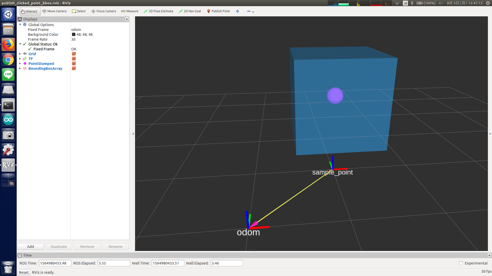

# publish_clicked_point_bbox.py



## What Is This

This node subscribes `geometry_msgs/PointStamped` message and publishes
`jsk_recognition_msgs/BoundingBoxArray` at that point.

## Subscribing Topic

* `clicked_point` (`geometry_msgs/PointStamped`)

  Input point whose position is used for bounding box.


## Publishing Topic

* `bbox_with_clicked_point` (`jsk_recognition_msgs/BoundingBoxArray`)

  Output bounding box array.

  Dimensions of the box is set to `1 [m]` and frame ID is set to `odom`.

  So the transformation between `clicked_point/header/frame_id` and `odom` should be resolvable.


## Sample

```bash
roslaunch jsk_pcl_ros sample_publish_clicked_point_bbox.launch
```
