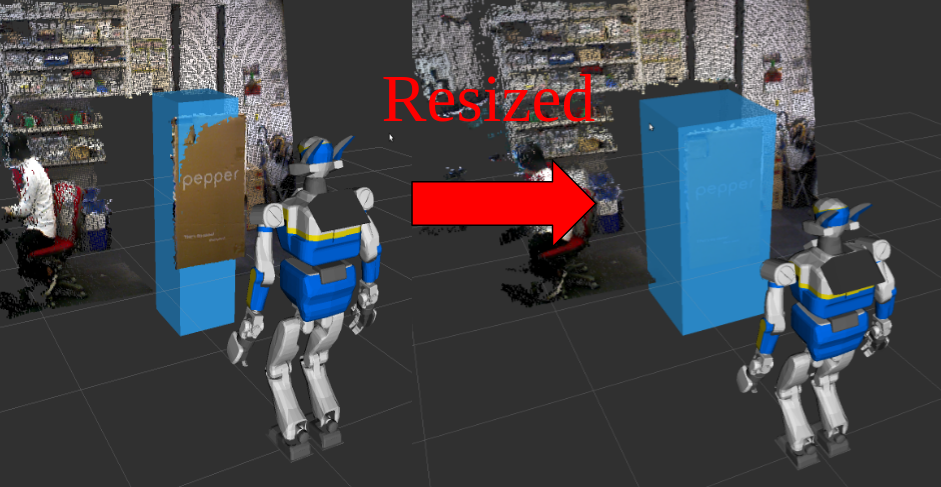

RearrangeBoundingBox
====================

What is this?
-------------

Rearrange and Rescale BoundingBoxArray.

Subscribing Topics
------------------

- ``~input`` (``jsk_recognition_msgs/BoundingBoxArray``)

Publishing Topics
-----------------

- ``~output`` (``jsk_recognition_msgs/BoundingBoxArray``)

Parameters
----------

- ``~offset_x`` (``Double``, default: ``0.0``)

- ``~offset_y`` (``Double``, default: ``0.0``)

- ``~offset_z`` (``Double``, default: ``0.0``)

- ``~scale_x`` (``Double``, default: ``1.0``)

- ``~scale_y`` (``Double``, default: ``1.0``)

- ``~scale_z`` (``Double``, default: ``1.0``)

- ``~rotate_x`` (``Double``, default: ``0.0``)

- ``~rotate_y`` (``Double``, default: ``0.0``)

- ``~rotate_z`` (``Double``, default: ``0.0``)

Sample
------

.. code-block:: bash

  roslaunch jsk_pcl_ros sample_rearrange_bounding_box.launch
