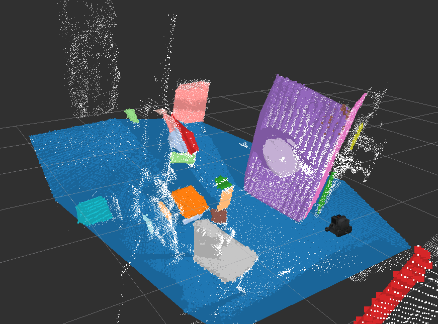
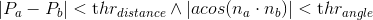

# RegionGrowingMultiplePlaneSegmentation


`jsk_pcl/RegionGrowingMultiplePlaneSegmentation` estimates multiple planes from pointcloud.

It extracts planes based on [region growing](http://en.wikipedia.org/wiki/Region_growing)
and evaluation function of connectivity if based on the following equation:


## Subscribing Topics
* `~input` (`sensor_msgs/PointCloud2`):

   input pointcloud.

   Point type should be `pcl::PointXYZRGB`.

* `~input_normal` (`sensor_msgs/PointCloud2`):

   normal pointcloud of `~input`.

   Point type should be `pcl::Normal`.


## Publishing Topics
* `~output/clustering_result` (`jsk_recognition_msgs/ClusterPointIndices`):

  Result of region growing as cluster.

* `~output/inliers` (`jsk_recognition_msgs/ClusterPointIndices`):

  Set of indices of the polygons.

* `~output/coefficients` (`jsk_recognition_msgs/ModelCoefficientsArray`):

  Array of coefficients of the polygons.

* `~output/polygons` (`jsk_recognition_msgs/PolygonArray`):

  Plane polygons.

* `~output/latest_time` (`std_msgs/Float32`)

  latest computation time

* `~output/average_time` (`std_msgs/Float32`)

  average computation time


## Parameters
* `~angular_threshold` (Double, default: `0.04`)

   Angular threshold in [rad] to connect two points in one cluster.

* `~distance_threshold` (Double, default: `0.01`)

   Distance threshold in [m] to connect two points in one cluster.

* `~max_curvature` (Double, default: `0.1`)

   Before extracting planes, filtering out the points which have higer curvature than this value.

* `~min_size` (Integer, default: `100`)

   The minimum number of the points of each plane.

* `~max_size` (Integer, default: `25000`)

   The maximum number of the points of each plane.

   Currently this parameter is disabled and `unlimited` is set instead.

* `~min_area` (Double, default: `0.1`)

   The minimum area of the convex planes in [m^2].

* `~max_area` (Double, default: `100`)

   The maximum area of the convex planes in [m^2].

* `~cluster_tolerance` (Double, default: `0.1`)

   The spatial tolerance in [m] for new cluster candidates.

* `~ransac_refine_outlier_distance_threshold` (Double, default: `0.1`)

   Outlier threshold in [m] for plane estimation using RANSAC.

* `~ransac_refine_max_iterations` (Integer, default: `100`)

   The maximum number of the iterations for plane estimation using RANSAC.

Note that these parameters can be changed by `dynamic_reconfigure`.


## Sample

```bash
roslaunch jsk_pcl_ros sample_region_growing_multiple_plane_segmentation.launch
```
