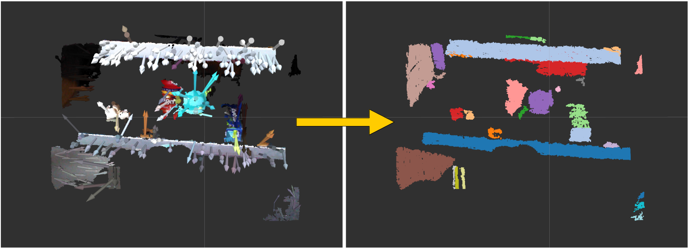

# RegionGrowingSegmentation



## What Is This

This node segment point cloud by using `pcl::RegionGrowing`.


## Subscribing Topic

* `~input` (`sensor_msgs/PointCloud2`)

  Point cloud to be segmented.

  It should have `xyz` and `normal` field and should not have `NaN` points.


## Publishing Topic

* `~output` (`jsk_recognition_msgs/ClusterPointIndices`)

  Result of clustering.


## Parameter

* `~number_of_neighbors` (Int, default: `10`)

  Number of the neighbors used in KdTree search.

* `~min_size` (Int, default: `20`)

  Minimum number of points that a cluster needs to contain in order to be considered valid.

* `~max_size` (Int, default: `25000`)

  Maximum number of points that a cluster needs to contain in order to be considered valid.

* `~smoothness_threshold` (Float, default: `pi / 2`)

  Threshold value for the angle between normals in radians.

* `~curvature_threshold` (Float, default: `0.1`)

  Threshold value for curvature testing.


## Sample

```bash
roslaunch jsk_pcl_ros sample_region_growing_segmentation.launch
```
