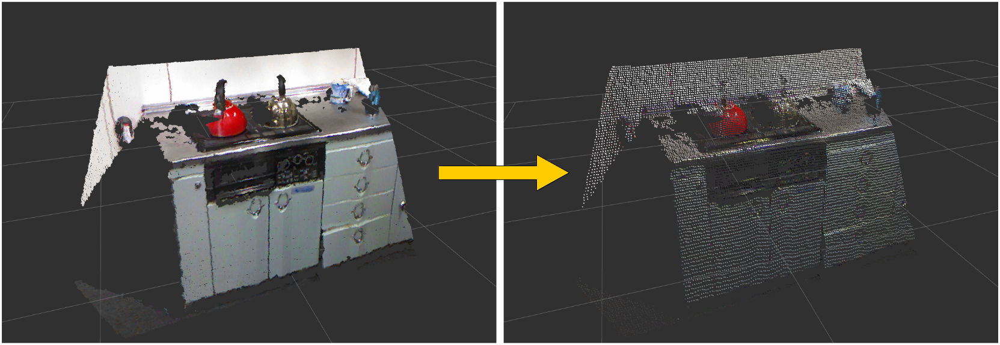

# ResizePointsPublisher



## What is this
`ResizePointsPublisher` resizes PointCloud generated from depth images.

It keeps *organized* pointcloud.
For example you can create QVGA pointcloud from VGA pointcloud of kinect like sensors.

## Subscribing Topics
* `~input` (`sensor_msgs/PointCloud2`):

   Input PointCloud. The input should be organized pointcloud.

* `~input/mask` (`sensor_msgs/Image`):

   Mask image used for automatically updating `~step_x` and `~step_y`.

* `~indices` (`pcl_msgs/PointIndices`):

   Points of only these indices will be extracted and resized.

   To subscribe this topic, `~use_indices` must be set to true.

## Publishing Topics.
* `~output` (`sensor_msgs/PointCloud2`):

   Output PointCloud. The output will be organized.

## Parameters
* `~step_x`, `~step_y` (Double, default: `2`):

   Binning step when resizing pointcloud.

   These parameters can be changed by `dynamic_reconfigure`.

* `~use_indices` (Boolean, default: `false`):

   If true, `~indices` is subscribed.

* `~not_use_rgb` (Boolean, default: `false`):

   If you want to resize pointcloud without RGB fields, you need to set this parameter to True.

## Sample

```bash
roslaunch jsk_pcl_ros sample_resize_points_publisher.launch
```
