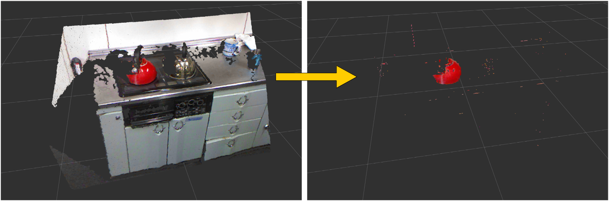

# RGBColorFilter



Filter pointcloud based on RGB range.

## Subscribing Topic
* `~input` (`sensor_msgs/PointCloud2`)

  Input pointcloud. rgb field is required.

* `~indices` (`pcl_msgs/PointIndices`)

  Indices of pointcloud. only available if `~use_indices` is true.

## Publishing Topic
* `~output` (`sensor_msgs/PointCloud2`)

  Filtered pointcloud.

## Parameters
* `~keep_organized` (Bool, default: `False`)

  Whether to publish organized point cloud if possible.

* `~use_indices` (Bool, default: `False`)

  If true, apply filter only in `~indices` region.

* `~r_max` (Integer, default: `255`)
* `~r_min` (Integer, default: `0`)
* `~g_max` (Integer, default: `255`)
* `~g_min` (Integer, default: `0`)
* `~b_max` (Integer, default: `255`)
* `~b_min` (Integer, default: `0`)

  Color range to filter.

## Sample

```bash
roslaunch jsk_pcl_ros rgb_color_filter_sample.launch
```
