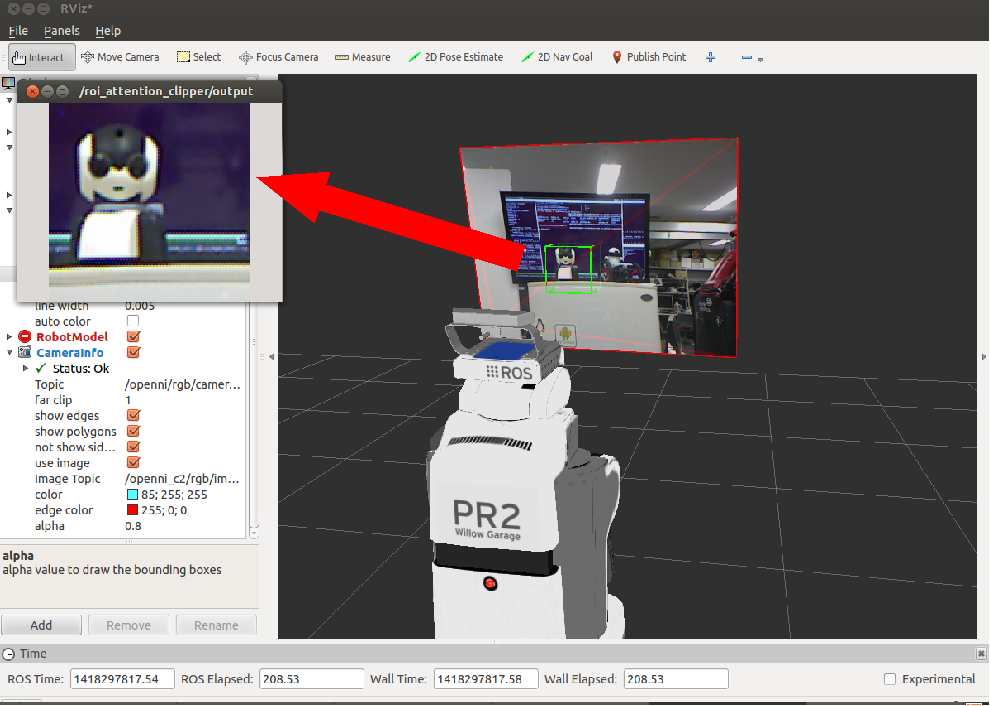

# ROIClipper
## What Is This

It retrives `sensor_msgs/Image` and `sensor_msgs/CameraInfo` and publish `sensor_msgs/Image` of ROI.
It is similar to `image_proc/crop_decimate` but you can use `CameraInfo/roi` field to specify ROI.

We expect to use jsk\_pcl/ROIClipper with jsk\_pcl/AttentionClipper to get ROI image.

## Subscribing Topic
* `~input/image` (`sensor_msgs/Image`)

  Input image.
* `~input/camera_info` (`sensor_msgs/CameraInfo`)

  Camera parameter and ROI field should be filled.

  These two topic should be synchronized if `~not_sync` is not false.

* `~input/cloud` (`sensor_msgs/PointCloud2`)

  This topic is only enabled if `~not_sync` is true.

## Publishing Topic
* `~output` (`sensor_msgs/Image`)

  Image of ROI.

* `~output/cloud_indices` (`pcl_msgs/PointIndices`)

  The indices of the pointcloud which is inside of the interest 3-D region.

* `~output/cloud` (`sensor_msgs/PointCloud2`)

  PointCloud clipped from `~input/cloud` and `~input/camera_info`.

## Parameter
* `~not_sync` (Bool, default: `False`)

  If ~not_sync is true, do not need to synchronize camera info and other input topics, and
  pointcloud clipping is enabled.