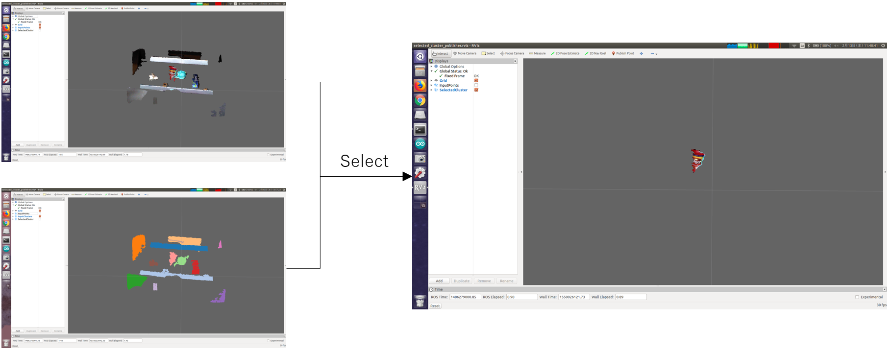

# SelectedClusterPublisher

## What Is This


Extract specified point cloud from input point cloud and clusters.

This feature provides functionality which is similar to the combination of `jsk_pcl_ros_utils/ClusterPointIndicesToPointIndices` + `jsk_pcl_ros/ExtractIndices`.

The former (this node) subscribes a topic for specifying index, and the latter gets paramater.


## Subscribing Topic

* `~input` (`sensor_msgs/PointCloud2`)

  Input point cloud from which specified part will be extracted.

* `~indices` (`jsk_recognition_msgs/ClusterPointIndices`)

  Input cluster indices.

* `~selected_index` (`jsk_recognition_msgs/Int32Stamped`)

  Index of cluster indices used for extraction.


## Publishing Topic

* `~output` (`sensor_msgs/PointCloud2`)

  Selected part of input point cloud.


## Parameter

* `~keep_organized` (Bool, default: `False`)

  Whether to keep organized for output point cloud.


## Sample

```bash
roslaunch jsk_pcl_ros sample_selected_cluster_publisher.launch
```
