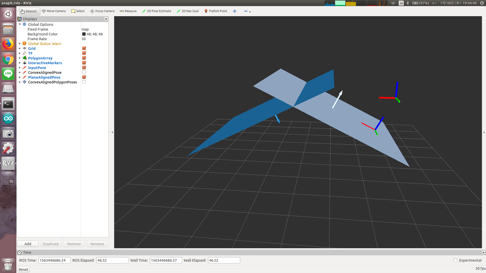

# Snapit



## What Is This

This node finds the nearest plane from input pose and publish pose aligned to that plane.


## Subscribing Topic

* `~input/polygons` (`jsk_recognition_msgs/PolygonArray`)

  Input latest plane polygon.

  This topic should be synchronized with `~input/polygon_coefficients`.

* `~input/polygon_coefficients` (`jsk_recognition_msgs/ModelCoefficientsArray`)

  This topic should be synchronized with `~input/polygons`,
  but no data in this topic is used for now.

* `~input/plane_align` (`geometry_msgs/PoseStamped`)

  Input pose.

  When this topic is subscribed, `~output/plane_aligned` will be published.

* `~input/convex_align` (`geometry_msgs/PoseStamped`)

  Input pose.

  When this topic is subscribed, `~output/convex_aligned` will be published.

* `~input/convex_align_polygon` (`geometry_msgs/PolygonStamped`)

  Plane polygon.

  When this topic is subscribed, `~output/convex_aligned_pose_array` will be published.


## Publishing Topic

* `~output/plane_aligned` (`geometry_msgs/PoseStamped`)

  Pose aligned to nearest plane.

* `~output/convex_aligned` (`geometry_msgs/PoseStamped`)

  Similar to `~output/plane_aligned`, but just relay `~input/convex_align`
  when the foot of the perpendicular line is not in any of input planes.

* `~output/convex_aligned_pose_array` (`geometry_msgs/PoseArray`)

  Array of pose of all vertices of input polygon.


## Advertising Service

* `~align_footstep` (`jsk_recognition_msgs/SnapFootStep`)

  Service API.

  Each pose is treated like `~input/convex_align`.


## Parameters

* `~use_service` (Bool, default: `False`)

  Whether to enable `~align_footstep`.


## Sample


```bash
roslaunch jsk_pcl_ros sample_snapit.launch
```
