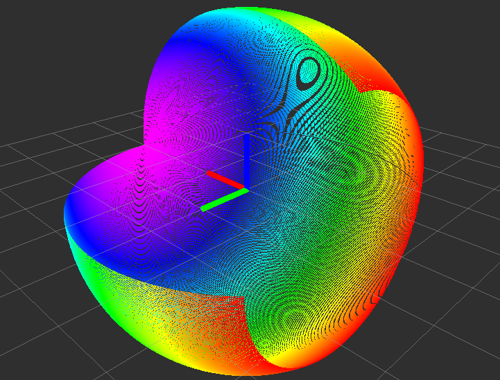

# SphericalPointCloudSimulator


Simulate a pointcloud which is acquired by spindle laser. Sensor model is
spherical laser.

## Subscribing Topics
* `~input` (`sensor_msgs/PointCloud2`)

  This topic is only used to synchronize timestamp of `~output` pointcloud
  to certain pointcloud. If no `~frame_id` is specified, frame_id of `~input`
  is copied to `~output`.

## Publishing Topics
* `~output` (`sensor_msgs/PointCloud2`)

  Simulated pointcloud.

## Parameters
* `~frame_id` (String, default: None)

  frame_id of output pointcloud. If not specified, frame\_id of `~input` is copied.
* `~r` (Double, default: `3.0`)

  Radius of spherical model.
* `~min_phi` (Double, default: `0.0`)

  Minimum angle of scanning plane.
* `~max_phi` (Double, default: `2pi`)

  Maximum angle of scanning plane.
* `~scan_range` (Double, default: `4.7`)

  Scan range of laser. The default value is same to hokuyo's parameter.
* `~scan_num` (Integer, default: `1081`)

  The number of points in one scan of laser.
  The default value is same to hokuyo's parameter.
* `~fps` (Double, default: `40`)

  Fps of laser sensor.
  The default value is same to hokuyo's parameter.

## Sample

```
roslaunch jsk_pcl_ros laser_camera_fov_sample.launch
```
