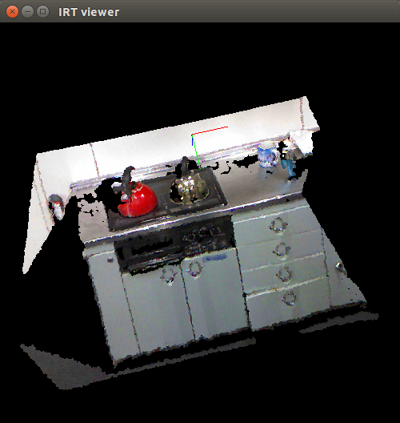

# store-pointcloud.l



## What Is This

This node shows point cloud in IRT viewer and stores it into a list internally.

## Subscribing Topic

* `/openni/depth_registered/points_throttle` (`sensor_msgs/PointCloud2`)

  Input point cloud.


## Publishing Topic

None.


## Sample

```bash
roslaunch jsk_pcl_ros sample_store_pointcloud.launch
```
