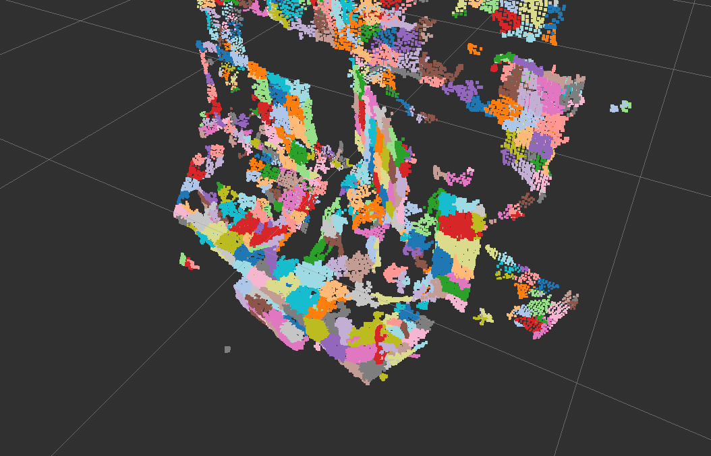

# SupervoxelSegmentation


Segment pointcloud based on Supervoxel technique.
see Voxel Cloud Connectivity Segmentation - Supervoxels for Point Clouds (J. Papon et al. CVPR2013).

## Subscribing Topic
* `~input` (`sensor_msgs/PointCloud2`)

  Input pointcloud. It should have rgb field.

## Publishing Topic
* `~output/cloud` (`sensor_msgs/PointCloud2`)

  Output pointcloud downsampled by voxel grid.

* `~output/indices` (`jsk_recognition_msgs/ClusterPointIndices`)

  Clustering result.

## Parameters
* `~color_importance` (`Double`, default: `0.2`)

  Color importance factor.

* `~spatial_importance` (`Double`, default: `0.4`)

  Spatial importance factor.

* `~normal_importance` (`Double`, default: `1.0`)

  Normal importance factor.

* `~use_transform` (`Boolean`, default: `True`)

  Use single cloud transform

* `~seed_resolution` (`Double`, default: `0.1`)

  Seed resolution of super voxels.

* `~voxel_resolution` (`Double`, default: `0.008`)

  Voxel grid resolution of super voxels.

## Sample

```bash
roslaunch jsk_pcl_ros sample_supervoxel_segmentation.launch
```
