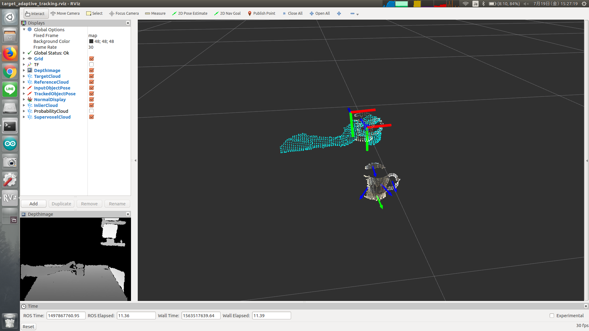

# TargetAdaptiveTracking



## What Is This

This node finds the nearest plane from input pose and publish pose aligned to that plane.


## Subscribing Topic

* `~input_obj_cloud` (`sensor_msgs/PointCloud2`)

  Object point cloud used for initialization.

* `~input_bkgd_cloud` (`sensor_msgs/PointCloud2`)

  Background point cloud used for initialization.

* `~input_obj_pose` (`geometry_msgs/PoseStamped`)

  Object pose used for initialization.

Note that `~input_obj_cloud`, `~input_bkgd_cloud` and `~input_obj_pose` should be synchronized.

* `~input_cloud` (`sensor_msgs/PointCloud2`)

  Target point cloud.

* `~input_pose` (`geometry_msgs/PoseStamped`)

  Object pose used for updating motion displacement.

Note that `~input_cloud` and `~input_pose` shoule be synchronized.


## Publishing Topic

* `/selected_pointcloud` (`sensor_msgs/PointCloud2`)

  Template point cloud to track.

* `/target_adaptive_tracking/output/object_pose` (`geometry_msgs/PoseStamped`)

  Result pose of tracking.

* `/target_adaptive_tracking/output/cloud` (`sensor_msgs/PointCloud2`)

  Relay of `~input_cloud`.

* `/target_adaptive_tracking/output/normal` (`sensor_msgs/PointCloud2`)

  Point cloud of centroid with `normal` field.

* `/target_adaptive_tracking/output/inliers` (`sensor_msgs/PointCloud2`)

  Point cloud of inliers.

* `/target_adaptive_tracking/output/centroids` (`sensor_msgs/PointCloud2`)

  Point cloud of estimated position.

* `/target_adaptive_tracking/output/probability_map` (`sensor_msgs/PointCloud2`)

  Point cloud representing probability.

* `/target_adaptive_tracking/supervoxel/cloud` (`sensor_msgs/PointCloud2`)
* `/target_adaptive_tracking/supervoxel/indices` (`jsk_recognition_msgs/ClusterPointIndices`)

  Result point cloud / cluster point indices of supervoxel segmentation.

* `/target_adaptive_tracking/supervoxel/tdp_indices` (`jsk_recognition_msgs/ClusterPointIndices`)

  Filtered cluster point indices of supervoxel segmentation.


## Parameters

* `~use_tf` (Bool, default: `False`)

  Whether to look up transform between `~parent_frame_id` and `~child_frame_id`
  to update transform.

* `~parent_frame_id` (String, default: `/track_result`)

  Parent frame ID.

  This parameter is used only when `~use_tf` is True.

* `~child_frame_id` (String, default: `/camera_rgb_optical_frame`)

  Child frame ID used for `/target_adaptive_tracking/output/cloud` and
  `/target_adaptive_tracking/output/object_pose`.

* `~color_importance` (Float, default: `0.2`)
* `~spatial_importance` (Float, default: `0.4`)
* `~normal_importance` (Float, default: `1.0`)

  Importances used for supervoxel segmentation.

* `~use_transform` (Bool, default: `True`)

  This parameter is not used.

* `~seed_resolution` (Float, default: `0.1`)

  Average size in meters of resulting supervoxels.

* `~voxel_resolution` (Float, default: `0.008`)

  Resolution in meters of voxel used.

* `~min_cluster_size` (Int, default: `20`)

  Minimum number of supervoxels.

* `~threshold` (Float, default: `0.4`)

  Probability threshold.

* `~bin_size` (Int, default: `18`)

  Local structural rpy bin.

* `~eps_distance` (Float, default: `0.03`)
* `~eps_min_samples` (Int, default: `3`)

  These parameters are not used now.

* `~update_tracker_reference` (Bool, default: `False`)

  Whether to update tracking model.

* `~vfh_scaling` (Float, default: `0.7`)

  Likelihood scaling factor for vfh matching.

* `~color_scaling` (Float, default: `0.5`)

  Likelihood scaling factor for color matching.

* `~structure_scaling` (Float, default: `0.0`)

  Likelihood scaling factor for local voxel adjacency.

* `~update_filter_template` (Bool, default: `False`)

  Whether to update the particle filter tracking template.

* `~history_window_size` (Int, default: `5`)

  Number of frame after which the unmatched voxel is discarded.


## Sample

```bash
roslaunch jsk_pcl_ros sample_target_adaptive_tracking.launch
```
