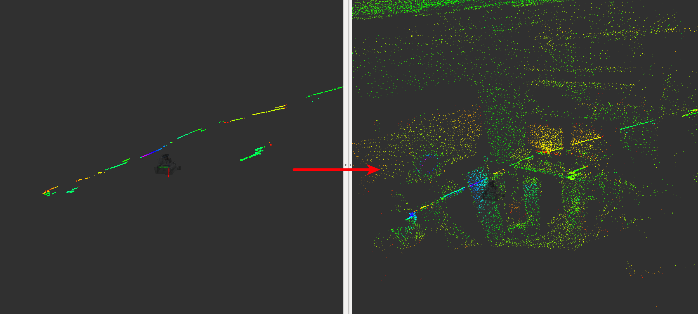

# TiltLaserListener
## What is this

Listen to the joint_states of tilt/spindle laser and publish time range to scane full 3-D space.
You can choose several types of tilt/spindle lasers such as tilt-laser of PR2, infinite spindle laser of multisense.

## Subscribing Topics
* `~input`(`sensor_msgs/JointState`):

   Joint angles of laser actuator.
* `~input/cloud`(`sensor_msgs/PointCloud2`):

   Input scan pointcloud, it only used if ~not_use_laser_assembler_service and ~use_laser_assembler is true.

## Publishing Topics
* `~output` (`jsk_recognition_msgs/TimeRange`):

   Time range to scan 3-D space.
* `~output_cloud` (`sensor_msgs/PointCloud2`):

   Assembled pointcloud according to time range
   of `~output`. this require `~assemble_scans2`
   service of [laser_assembler](http://wiki.ros.org/laser_assembler).
* `~output_velocity` (`geometry_msgs/TwistStamped`)

   Velocity of rotating laser. it is only published when `~twist_frame_id` is provided.

## Using Services
* `~assemble_scans2` (`laser_assembler/AssembleScans2`):

   A service to build 3-D pointcloud from scan pointcloud.
   It should be remapped to `assemble_scans2` service of
   [laser_assembler](http://wiki.ros.org/laser_assembler).

## Advertising Service
* `~clear_cache` (`std_srvs/Empty`)

   Clear cache and restart collecting data.

## Parameters
* `~max_queue_size` (Integer, default: `100`):

  Queu size of subscription.
* `~clear_assembled_scans` (Bool, default: `false`)

   Do not use assembled scans twice.
* `~skip_number` (Integer, default: `1`):

   Skip publishing and calling laser assembler per `~skip_number`.
* `~twist_frame_id`

  Frame id used in twist velocity.
* `~use_laser_assembler` (Boolean, default: `False`):

   Enable `~output_cloud` and `~assemble_scans2`.
* `~not_use_laser_assembler_service` (Boolean, default: `False`)

   When it is true, do not use laser_assembler service but assemble scan pointcloud locally.
* `~joint_name` (String, **required**):

   Joint name of actuator to rotate laser.
* `~laser_type` (String, default: `tilt_half_down`):

   type of rotating laser. You can choose one of the types:
   1. `tilt`: A mode for tilting laser. In this mode, TiltLaserListener assumes the motor to be moved from minimum
   joint angle to maximum joint angle over again. TiltLaserListener publishes the minimum and latest time range to
   move tilting laser from minimum joint angle to maximim joint angle.
   2. `tilt_half_down`:
   In this mode, TiltLaserListener publishes time range from maximum joint angle to minimum joint angle.
   3. `tilt_half_up`:
   In this mode, TiltLaserListener publishes time range from minimum joint angle to maximum joint angle like `tilt_half_down`.
   4. `infinite_spindle`: Infinite spindle laser. TiltLaserListener publishes time range to rotate laser 360 degrees.
   5. `infinite_spindle_half`: Infinite spindle laser, but most of laser has over 180 degrees range of field.
   Therefore we don't need to rotate laser 360 degrees to scan 3-D space, just 180 degree rotation is required.
   In this mode, TiltLaserListener publishes time range a time range of 180 degree rotation.
* `~overwrap_angle` (Double, default: `0.0`)

   overwrap angle offset when detecting time range.
   Only available in `infinite_spindle` and `infinite_spindle_half`.

## Troubleshooting
* tilt_laser_listener don't publish `~output_cloud` when `~laser_type` is `infinite_spindle` or `infinite_spindle_half`

  A: tilt_laser_listener doesn't publish ~output_cloud when ~laser_type is infinite_spindle or infinite_spindle_half if velocity field of ~input is not valid.
