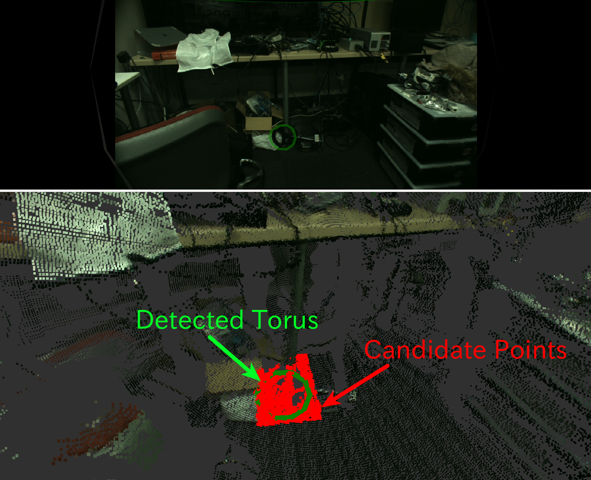

# TorusFinder


Find a torus out of pointcloud based on RANSAC with 3-D circle model.

## Subscribing Topic
* `~input` (`sensor_msgs/PointCloud2`)

  Input pointcloud. You may need to choose good candidates of pointcloud.
* `~input/polygon` (`geometry_msgs/PolygonStamped`)

  Input polygon. You can use this topic as well as `~input`.

  Vertices of the polygon will be used for detecting torus.

## Publishing Topic

* `~output` (`jsk_recognition_msgs/Torus`)

  Output of detection.

* `~output/inliers` (`pcl_msgs/PointIndices`)
* `~output/coefficients` (`pcl_msgs/ModelCoefficients`)

  Inliers and coefficients which represents detection result.
* `~output/array` (`jsk_recognition_msgs/TorusArray`)

  Array of torus. It will be used for visualization.

* `~output/pose` (`geometry_msgs/PoseStamped`)

  Publish result of detection as `geometry_msgs/PoseStamped`

* `~output/with_failure` (`jsk_recognition_msgs/Torus`)
* `~output/with_failure/array` (`jsk_recognition_msgs/TorusArray`)

  Output of detection with failure information.

* `~output/latest_time` (`std_msgs/Float32`)

  latest computation time

* `~output/average_time` (`std_msgs/Float32`)

  average computation time


## Parameters
* `~use_hint` (Bool, default: `False`)

  Whether to set hint axis which we need to search for a model perpendicular to.

* `~initial_axis_hint` (Array of Float, default: `[0, 0, 1]`)

  The axis along which we need to search for a model perpendicular to.

  This parameter is enabled only when `~use_hint` is True.

* `~use_normal` (Bool, default: `False`)

  Whether to use `normal` field of input pointcloud.

Parameters below can be changed by `dynamic_reconfigure`.

* `~algorithm` (String, default: `RANSAC`)

  Type of sample consensus method to use.

  Choose one from `RANSAC`, `LMEDS`, `MSAC`, `RRANSAC`, `RMSAC`, `MLESAC` and `PROSAC`.

* `~min_radius` (Double, default: `0.1`)
* `~max_radius` (Double, default: `1.0`)

  Minimum and maximum radius of torus in meters.
* `~min_size` (Integer, default: `10`)

  Minimum number of inliers.
* `~outlier_threshold` (Double, default: `0.01`)

  Outlier distance threshold used in RANSAC in meters.
* `~max_iterations` (Integer, default: `100`)

  Maximum number of iterations of RANSAC.

* `~eps_hint_angle` (Double, default: `0.1`)

  Maximum allowed difference between the model normal and the given axis in radians.

  This parameter is used only when `~use_hint` is True.

* `~voxel_grid_sampling` (Bool, default: `False`)

  Whether to downsample `~input` before detection.

* `~voxel_size` (Double, default: `0.02`)

  Leaf size of voxel grid in meters.

  This parameter is used only when `~voxel_grid_sampling` is True.

## Sample

```bash
roslaunch jsk_pcl_ros sample_torus_finder.launch
```
