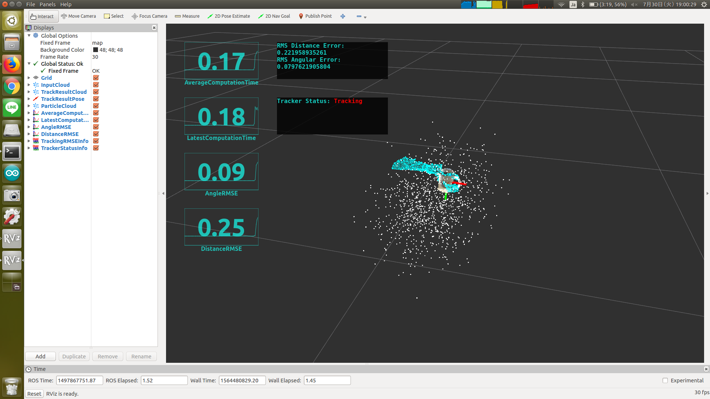

# tracker_status_info.py



Republish `jsk_recognition_msgs/TrackerStatus` topic as `jsk_rviz_plugins/OverlayText`.

This node is assumed to be used with [ParticleFilterTracking](particle_filter_tracking.md)

## Subscribing Topics

* `~input` (`jsk_recognition_msgs/TrackerStatus`)

  Whether a node is tracking object or not.


## Publishing Topics

* `~text` (`jsk_rviz_plugins/OverlayText`)

  Text message of `~input`.


## Sample

```bash
roslaunch jsk_pcl_ros sample_particle_filter_tracking_change_detection.launch
```
