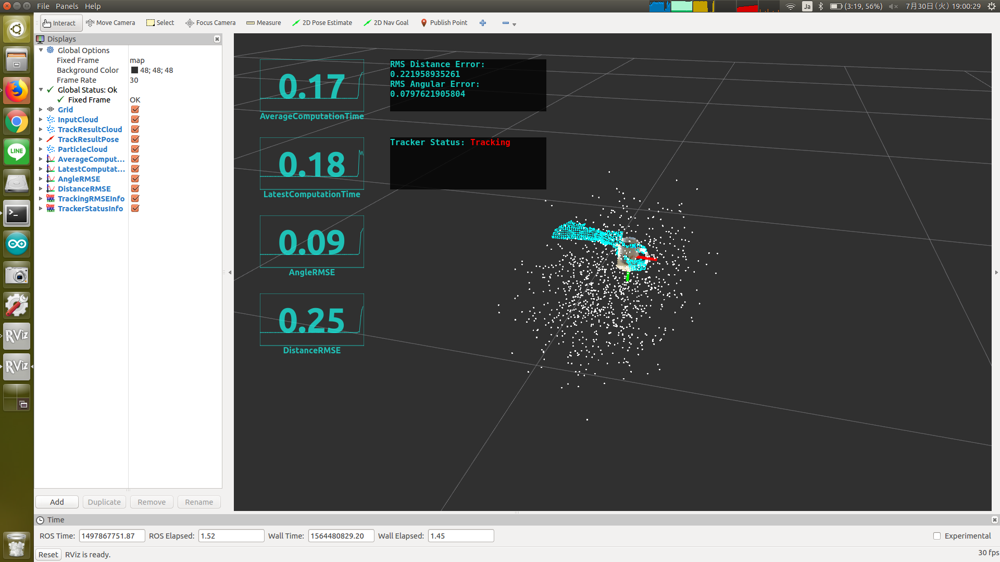

# tracking_info.py



Republish two `std_msgs/Float32` topics as `jsk_rviz_plugins/OverlayText`.

This node is assumed to be used with [ParticleFilterTracking](particle_filter_tracking.md)

## Subscribing Topics

* `~rms_angle_error` (`std_msgs/Float32`)
* `~rms_distance_error` (`std_msgs/Float32`)

  Root mean squared error of angle/distance.


## Publishing Topics

* `~text` (`jsk_rviz_plugins/OverlayText`)

  Text message of RMSEs.


## Sample

```bash
roslaunch jsk_pcl_ros sample_particle_filter_tracking_change_detection.launch
```
