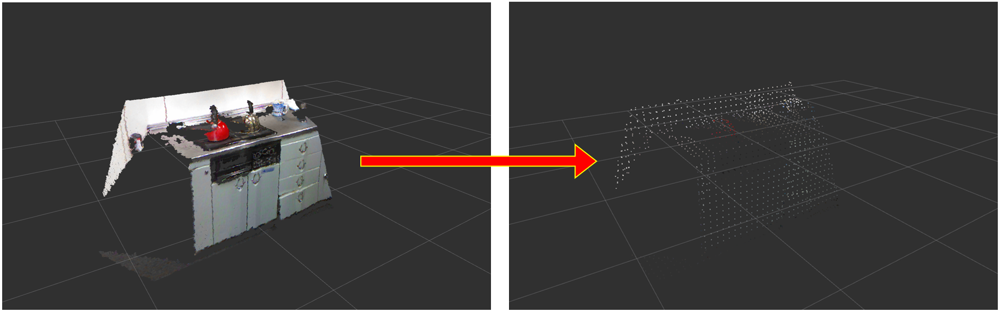

# VoxelGridDownsampleDecoder

## What Is This


Decode sliced point cloud encoded by `jsk_pcl_ros/VoxelGridDownsampleManager`, and publish it as a point cloud.


## Subscribing Topic

* `~input` (`jsk_recognition_msgs/SlicedPointCloud`)

  Encoded sliced point cloud.


## Publishing Topic

* `~output` (`sensor_msgs/PointCloud2`)

  Decoded point cloud.


## Sample

```bash
roslaunch jsk_pcl_ros sample_voxel_grid_downsample.launch
```
