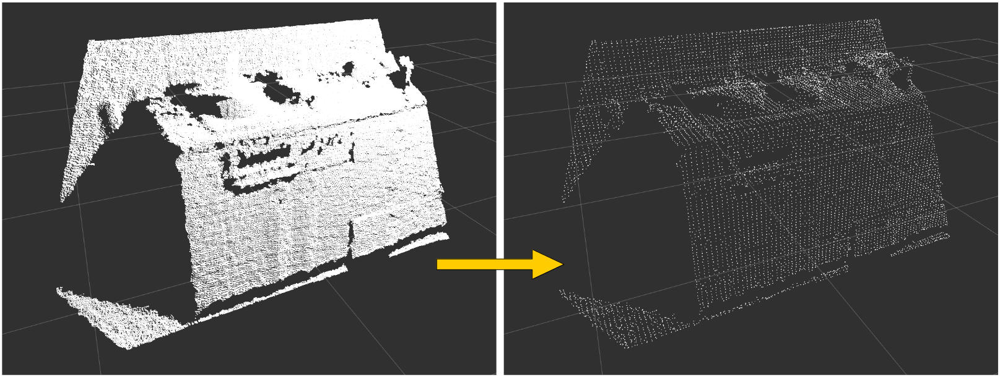

# VoxelGridLargeScale



VoxelGrid downsampler which can handle small leaf_size.
Only supports `pcl::PointXYZ`.

## Subscribing Topics
* `~input` (`sensor_msgs/PointCloud2`)

  Input cloud

## Publishing Topics
* `~output` (`sensor_msgs/PointCloud2`)

  Output downsampled cloud

## Parameters
* `~leaf_size` (Float, default: `0.01`)

  Size of voxel grid.

## Sample

```bash
roslaunch jsk_pcl_ros sample_voxel_grid_large_scale.launch
```
