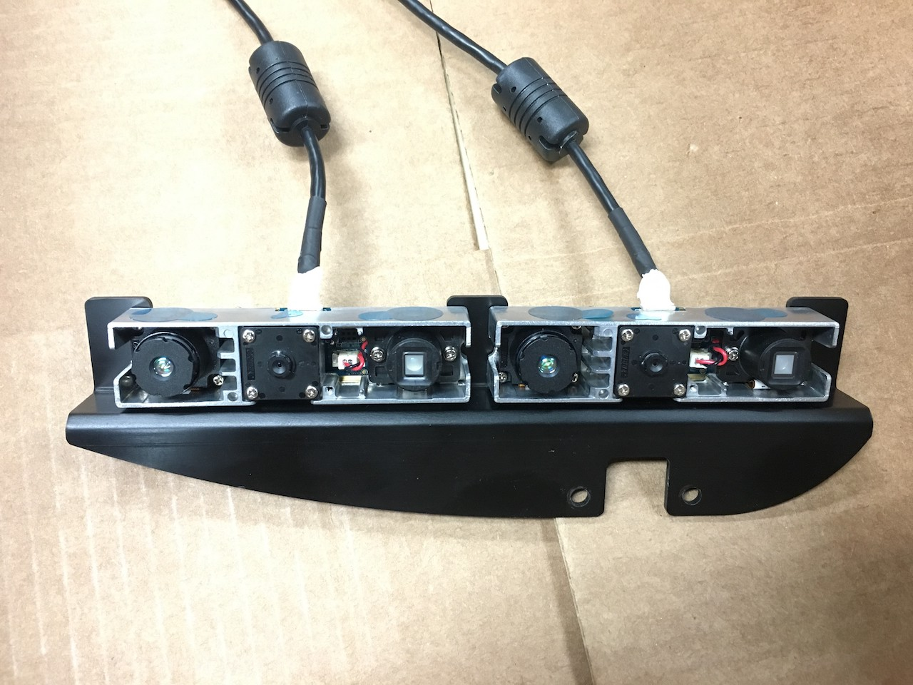

Triple RGB-D Fusion using Two Cameras
=====================================

Kentaro Wada, Yuto Uchimi, and Shun Hasegawa, University of Tokyo, JSK Laboratory

Why?
----

Depth information came from a mono RGB-D camera has many lacks of depth in each frame,
because of the noise of IR sensors and light reflection in dynamic scenes.
This leads the use of stereo sensor, but it also has difficulty of pixel matching
of textureless regions in a frame.
These problems motivate us to fuse RGB-D sensor inputs using multiple RGB-D cameras.

How?
----

The system overview is shown below and the input is 2 rgb images, 2 depths,
and camera parameters of both two cameras.

All sensor informations, rgb images and depths, is transformed to the frame of left
camera, and fused in the coordinate.
The rgb image and depth from left camera :math:`I_{left}(c_{left})`, :math:`D_{left}(c_{left})` is
inheritly in left frame (:math:`c_{left}`), so we don't need to transform it.
The right ones, :math:`I_{right}(c_{right})` and :math:`D_{right}(c_{right})`, is converted to point cloud
:math:`P_{right}(c_{right})` in right frame :math:`c_{right}`.
The point cloud is converted to rgb image :math:`I_{right}(c_{left})`
and depth :math:`D_{right}(c_{left})` in left frame.
Stereo depth is given from stereo matching using camera parameters and rgb images from the two cameras,
and usually the output rgb image and depth is in left frame: :math:`I_{stereo}(c_{left})`, :math:`D_{stereo}(c_{left})`.

In above paragraph, we describe the way to acquire rgb images and depths
from ir sensors in two rgb-d cameras and stereo matching.
Now we have 3 rgb images:
:math:`I_{left}(c_{left})`, :math:`I_{right}(c_{left})`, :math:`I_{stereo}(c_{left})`,
and 3 depths:
:math:`D_{left}(c_{left})`, :math:`D_{right}(c_{left})`, :math:`D_{stereo}(c_{left})`.
in left frame, then we explain the operation of fusions of them.
For rgb images, we use `or` operation, and `avg` operation for depths.

.. math::

   I_{fused}(c_{left}) = Op_{or} (I_{left}(c_{left}), I_{right}(c_{left}, I_{stereo}(c_{left})) \\
                       = Op_{or} (I_{left}, I_{right}, I_{stereo}) \\
   D_{fused}(c_{left}) = Op_{avg} (D_{left}(c_{left}), D_{right}(c_{left}), D_{stereo}(c_{left})) \\
                       = Op_{avg} (D_{left}, D_{right}, D_{stereo}) \\
                       = (D_{left} + D_{right} + D_{stereo}) / 3

The right bottom pictures in above figure of system figure shows fused result of rgb image and depth:
:math:`I_{fused}(c_{left})` and :math:`D_{fused}(c_{left})`.
We use `or` operation for rgb image to avoid cracks in the output image caused by error in calibration,
and `avg` for depth to reduce noise assuming that depth is changed smoothly in frame.

Sample
------

You can see implementations by using sample in `jsk_recognition <https://github.com/jsk-ros-pkg/jsk_recognition.git>`_.
There are rosbag, and you can see triple depth fusion by streaming.

.. code-block:: bash

  roslaunch jsk_pcl_ros sample_fuse_depth_images.launch

.. image:: images/stereo_rgbd_fusion_sample.gif
   :width: 60%

Hardware
++++++++

For real world use, you need hardware of stereo rgb-d camera.
Any rgb-d cameras should be fine, but for your information,
we write here we used two `Astra Mini S <http://shop-orbbec3d-com.3dcartstores.com/Orbbec-Astra-Mini-S_p_41.html>`_ cameras
in the experiemnt.

Acknowledgement
---------------
Yuto Uchimi contributed this work by calibrating both intrinsic and extrinsic camera parameters for stereo,
and Shun Hasegawa created hardware attachment to combine two cameras.
Kentaro Wada proposed, implemented the stereo rgb-d system and wrote this document.
