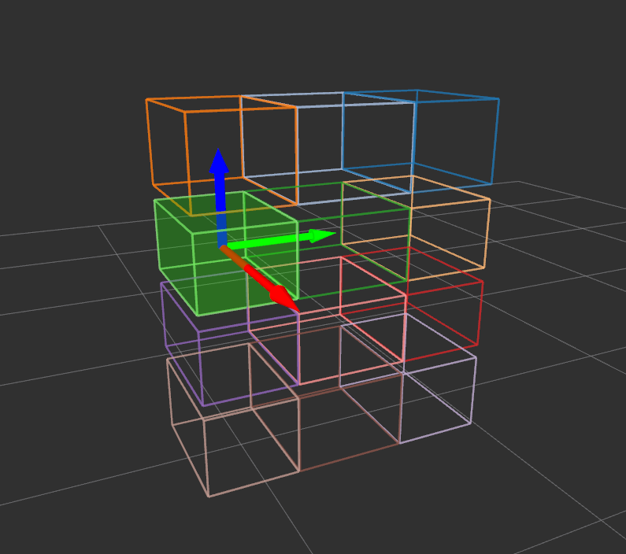

BoundingBoxArrayToBoundingBox
=============================

What is this?
-------------

Convert ``jsk_recognition_msgs/BoundingBoxArray`` to ``jsk_recognition_msgs/BoundingBox``.

Subscribing Topic
-----------------

* ``~input`` (``jsk_recognition_msgs/BoundingBoxArray``)

  Bounding box array.

Publishing Topic
----------------

* ``~output`` (``jsk_recognition_msgs/BoundingBox``)

Parameters
----------

* ``~index`` (Int, default: ``-1``)

  Index value where bounding box is extracted from bounding box array.
  Please note that negative index is skipped.
