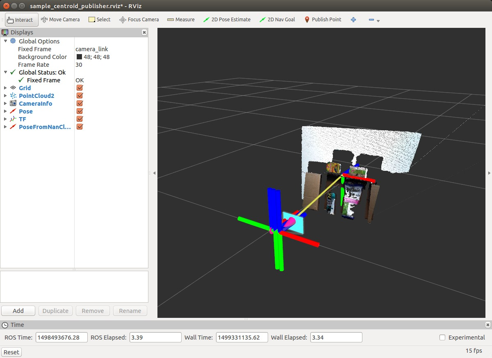

# CentroidPublisher
## What Is This



This nodelet will subscribe the sensor\_msgs::PointCloud2 or jsk\_recognition\_msgs/PolygonArray and calculate its centroid.
This also broadcasts coodinates of cloud or each polygons as `tf` whose parent is cloud headers frame\_id and whose child is the new centroid frame_id.

## Subscribing Topics
* `~input` (`sensor_msgs/PointCloud2`):

   Input pointcloud.
* `~input/polygons` (`jsk_recognition_msgs/PolygonArray`):

   Input polygon.

## Publishing Topics
* `/tf`

   Publish tf of the centroid of the input pointcloud.
* `~output/pose` (`geometry_msgs/PoseStamped`)

   Centroid of the pointcloud as `geometry_msgs/PoseStamped`.
* `~output/point` (`geometry_msgs/PointStamped`)

   Centroid of the pointcloud as `geometry_msgs/PointStamped`.
* `~output/pose_array` (`geometry_msgs/PoseArray`)

   Centroid poses of each polygons.

## Parameters
* `~frame` (String, default: node name):

   A frame_id for centroid tf.
   For polygon array, suffix numbers are appended. (e.g. `frame00`)

* `~publish_tf` (Boolean, default: `False`)
  Set this parameter to `True` in order to publish tf frame.
  The invalid centroid is filtered and tf is not published in that case.
  Note that if this option is `True`, input topics are always subscribed.

## Sample

```
roslaunch jsk_pcl_ros_utils sample_centroid_publisher.launch
```
