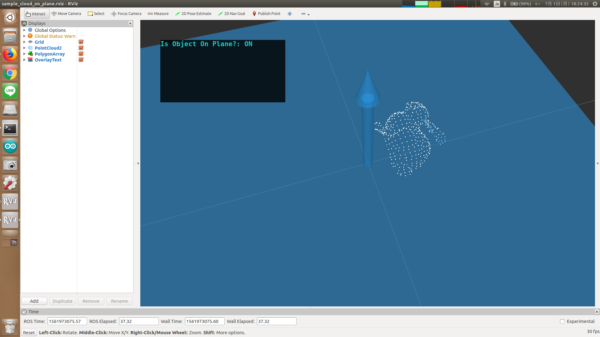

# cloud_on_plane_info.py



## What Is This

Subscribe bool value representing whether object is on the plane or not, and publish a text.


## Subscribing Topic

* `~input` (`jsk_recognition_msgs/BoolStamped`)

  Boolean value.


## Publishing Topic

* `~text` (`jsk_rviz_plugins/OverlayText`)

  Output text.

  This text can be visualized with Rviz.


## Parameters

None.


## Sample

```bash
roslaunch jsk_pcl_ros_utils sample_cloud_on_plane.launch
```
