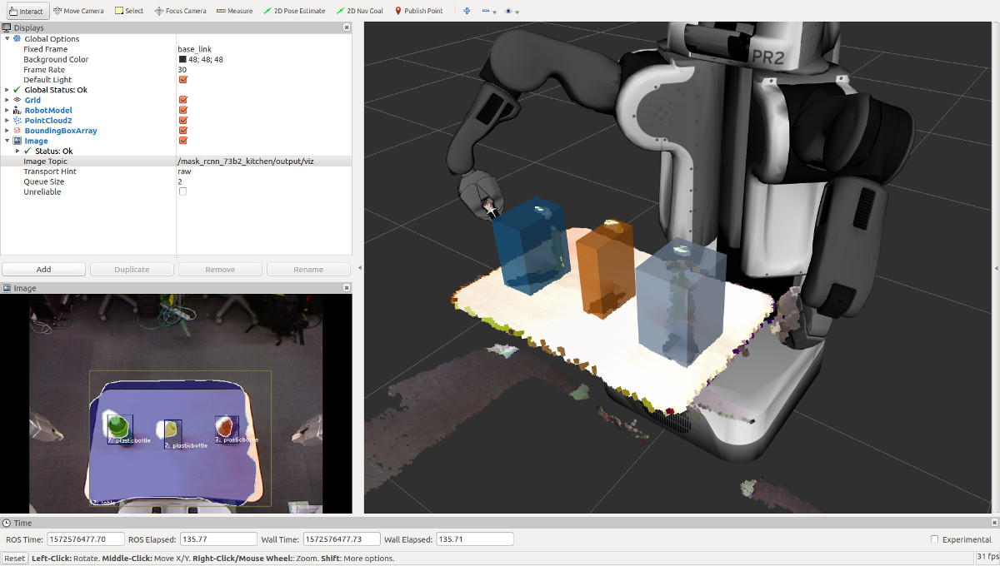

# ClusterPointIndicesLabelFilter
## What Is This

This nodelet selects and republishes the ClusterPointIndices which belong to a certain label present in a LabelArray topic.

## Subscribing Topics
* `~input/indices` (`jsk_recognition_msgs/ClusterPointIndices`):

   Input indices.
* `~input/labels` (`jsk_recognition_msgs/LabelArray`):

   Input labels.

## Publishing Topics
* `~output` (`jsk_recognition_msgs/ClusterPointIndices`):

  Filtered cluster point indices.

## Parameters
* `~label_value` (Int, default: `0`):

   Label id to filter input cluster point indices.

* `~approximate_sync` (Boolean, default: `False`)
   Policy of synchronization, if False it synchornizes exactly, else approximately.

* `~queue_size` (Int, default: `100`)
   Queue size of topic msgs for synchronization.
