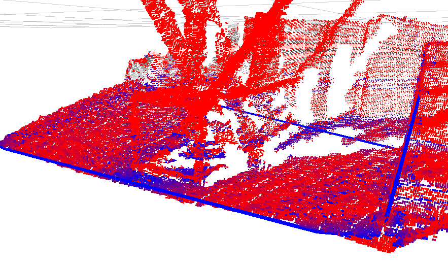

# ColorizeDistanceFromPlane



## What Is This

Colorize points based on distance from planes.
This is usefull for calibration.

## Subscribing Topic
* `~input` (`sensor_msgs/PointCloud2`)

  Input point cloud.

* `~input_coefficients` (`jsk_recognition_msgs/ModelCoefficientsArray`)

  Input model coefficients. This topic is used only for synchronizing.

* `~input_polygons` (`jsk_recognition_msgs/PolygonArray`)

  Input plane.

## Publishing Topic
* `~output` (`sensor_msgs/PointCloud2`)

  Output colorized point cloud.

## Parameters

* `~min_distance` (Float, default: `0.0`)
* `~max_distance` (Float, default: `0.1`)

  Minimum/maximum distance of point cloud from planes.

  Minimum corresponds to blue, while maximum corresponds to red.

  These parameters can be changed by `dynamic_reconfigure`.

* `~only_projectable` (Bool, default: `False`)

  Draw points only if then can be projected inside of convex.

  This parameter can be changed by `dynamic_reconfigure`.

## Sample

```bash
roslaunch jsk_pcl_ros_utils sample_colorize_distance_from_plane.launch
```
