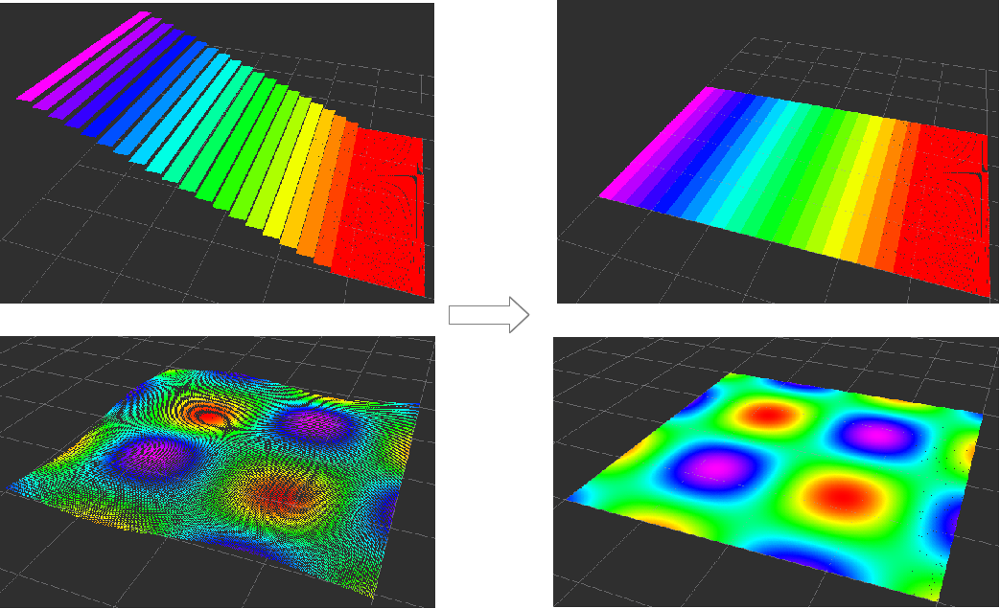

# ColorizeHeight2DMapping


Utility nodelet to visualize heightmap as pointcloud.
It just set all the z of points 0 and assign z to intensity.

## Subscribing Topics
* `~input` (`sensor_msgs/PointCloud2`)

  Input pointcloud.


## Publishing Topics
* `~output` (`sensor_msgs/PointCloud2`)

  Output pointcloud. z values of points are 0 and intensity of points
  has z value.


## Sample

```bash
roslaunch jsk_pcl_ros_utils sample_colorize_height_2d_mapping.launch
```
