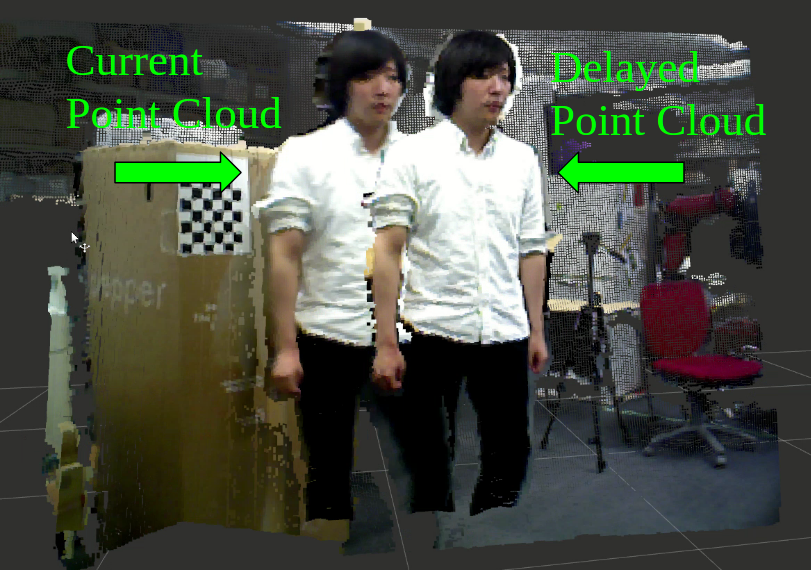

DelayPointCloud
===============

What is this?
-------------

Delay point cloud.

Subscribing Topics
------------------

- ``~input`` (``sensor_msgs/PointCloud2``)

  Original point cloud.

Publishing Topics
-----------------

- ``~output`` (``sensor_msgs/PointCloud2``)

  Delayed point cloud.

Parameters
----------

- ``~delay_time`` (``Double``, default: ``0.1``)

  Delay time from original point cloud in [sec].

- ``~queue_size`` (``Int``, int: ``1000``)

  Queue size of subscriber.

  It should be greater than ``~delay_time`` * rate of ``~input``.

Sample
------

.. code-block:: bash

  roslaunch jsk_pcl_ros_utils sample_delay_pointcloud.launch
