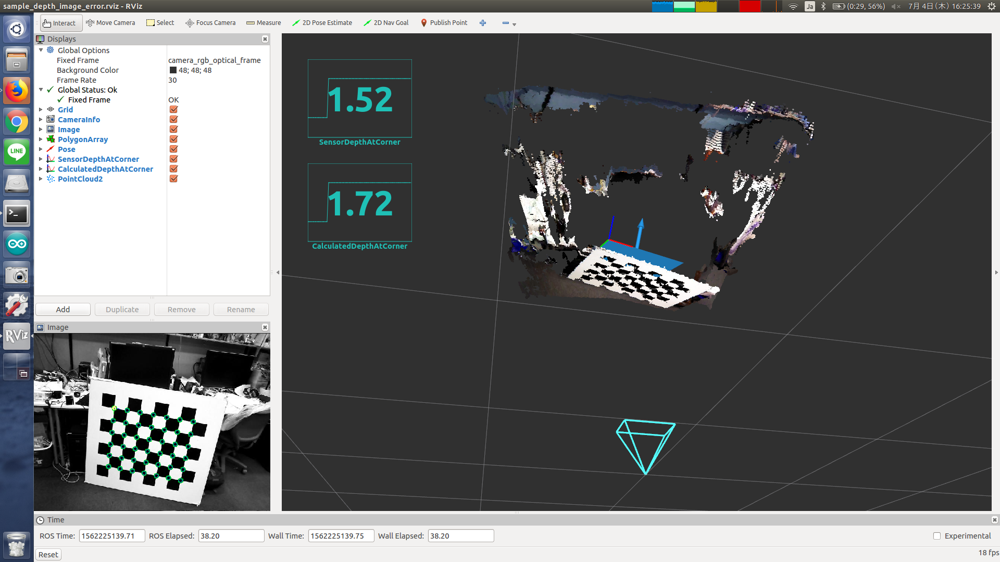

# DepthImageError



Compute error of depth image and corner point of checker board.

## Subscribing Topic
* `~image` (`sensor_msgs/Image`)

  Input rectified and registered depth image whose encoding is `32FC1`
  (i.e. metric is [m]).

* `~camera_info` (`sensor_msgs/CameraInfo`)

  Depth_registered camera info.

* `~point` (`geometry_msgs/PointStamped`)

  Corner point of checkerboard whose frame_id is the same as rgb image.

  x and y field should represent (u, v) point in [pixels],
  while z field should represent depth in [m].

## Publishing Topic
* `~output` (`jsk_recognition_msgs/DepthErrorResult`)

  Error between depth image and `~point`.

## Parameters
* `~approximate_sync` (boolean, default: `false`)

  Use approximate sync if it is true.

## Sample

```bash
roslaunch jsk_pcl_ros_utils sample_depth_image_error.launch
```
