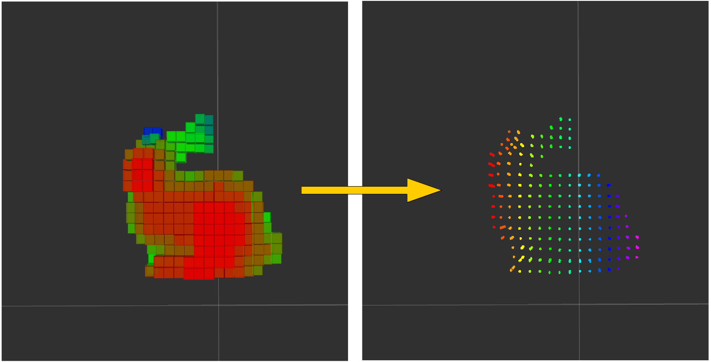

# MarkerArrayVoxelToPointCloud



## What is this?

A nodelet to convert marker array into point cloud.


## Subscribing Topic

* `~input` (`visualization_msgs/MarkerArray`)

  Input marker array.

  Position of each point will be copied from `points` field,
  while color from `color` field.


## Publishing Topic

* `~output` (`sensor_msgs/PointCloud2`)

  Output point cloud converted from `~input`.


## Parameters

None.


## Sample

```bash
roslaunch jsk_pcl_ros_utils sample_marker_array_voxel_to_pointcloud.launch
```
