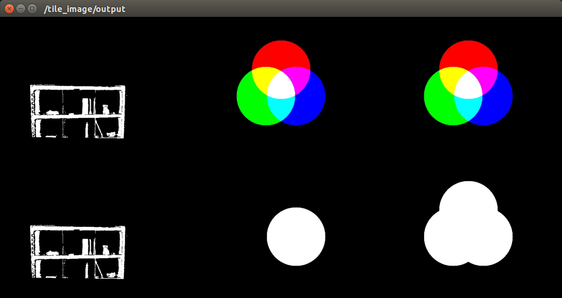

# MaskImageToPointIndices



A nodelet to convert mask image (`sensor_msgs/Image`) to point indices
(`pcl_msgs/PointIndices` or `jsk_recognition_msgs/ClusterPointIndices`) for
organized pointcloud.

## Subscribing Topic
* `~input` (`sensor_msgs/Image`)

  Input mask image.

## Publishing Topic
* `~output` (`pcl_msgs/PointIndices`)

  Output indices converted from the mask image.

* `~output/all_indices` (`jsk_recognition_msgs/ClusterPointIndices`)

  Output all indices converted from the mask image.

## Parameters
* `~use_multi_channels` (Bool, default: `false`)

  Handle input as multi-channeled mask image (a.k.a label image) if enabled this option.

* `~target_channel` (Int, default `-1`)

  This option is valid only when `~use_multi_channels` is enabled.
  Target channel of mask image which is to be published to `~output` as indices.
  If the option is set as `-1` (set by default), all channels are counted
  and published to `~output/all_indices` instead of `~output`.


## Sample

```bash
roslaunch jsk_pcl_ros_utils sample_mask_image_to_point_indices.launch
```
