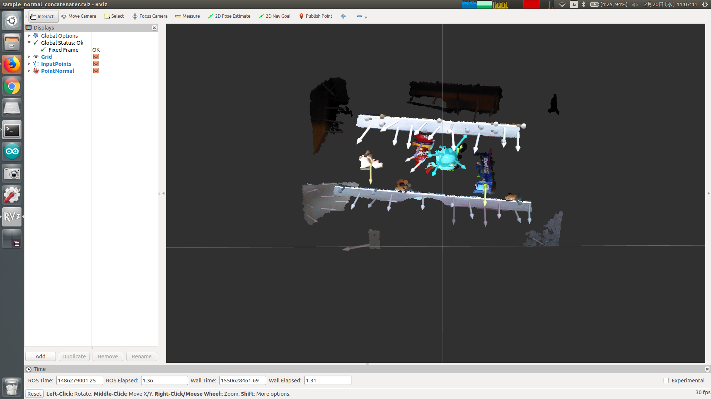

# NormalConcatenater

## What Is This


Concatenate two input point cloud.

One contains xyz and rgb field, and the other contains normal_xyz and curvature field.


## Subscribing Topic

* `~input` (`sensor_msgs/PointCloud2`)

  Point cloud which contains xyz and rgb field.

* `~normal` (`sensor_msgs/PointCloud2`)

  Point cloud which contains normal_xyz and curvature field.


## Publishing Topic

* `~output` (`sensor_msgs/PointCloud2`)

  Concatenated point cloud.


## Parameter

* `~use_async` (Bool, default: `False`)

  Whether to enable approximate synchronization policy.

* `~max_queue_size` (Int, default: `100`)

  Queue size for message_filters synchronization.


## Sample

```bash
roslaunch jsk_pcl_ros_utils sample_normal_concatenater.launch
```
