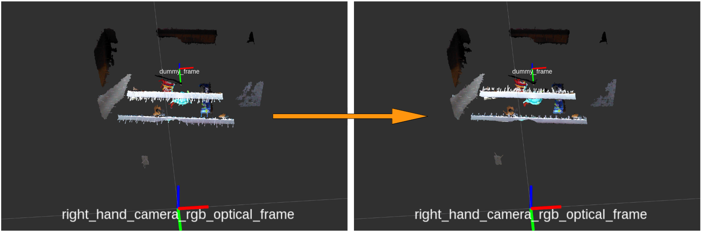

# NormalFlipToFrame



Flip normal direction towards specified frame.

## Subscribing Topics
* `~input` (`sensor_msgs/PointCloud2`)

  Input pointcloud. It should have normal fields.

## Publishing Topics
* `~output` (`sensor_msgs/PointCloud2`)

  Output pointcloud whose normal vector orients toward specified frame by `~frame_id`.

## Parameters
* `~frame_id` (String, **required**)

  Frame ID which is to be oriented by normal vectors.

* `~strict_tf` (Bool, default: `false`)

  Do not take into account timestamp if this parameter is false.

## Sample

```bash
roslaunch jsk_pcl_ros_utils sample_normal_flip_to_frame.launch
```
