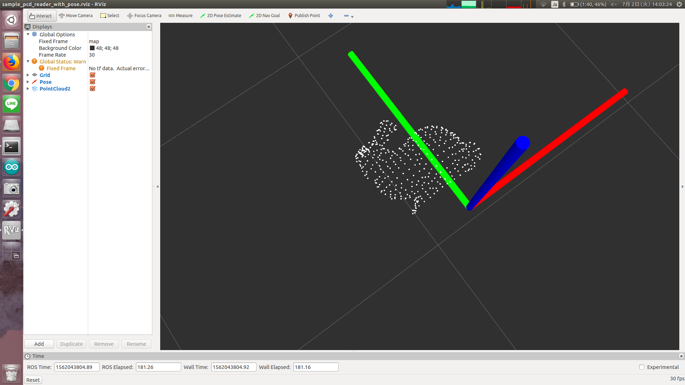

# PCDReaderWithPose



Publish cloud with given pose

## Parameters
* `~pcd_file` (Strng, required)

  file name of pcd for publish

## Subscribing Topocs
* `~input` (`geometry_msgs/PoseStamped`)

  Pose for published pcd.

## Publishing Topics
* `~output` (`sensor_msgs/PointCloud2`)

  Point cloud whose position and orientation is filled from `~input`.

  Also, frame ID will be the same as `~input`.

## Sample

```bash
roslaunch jsk_pcl_ros_utils sample_pcd_reader_with_pose.launch
```
