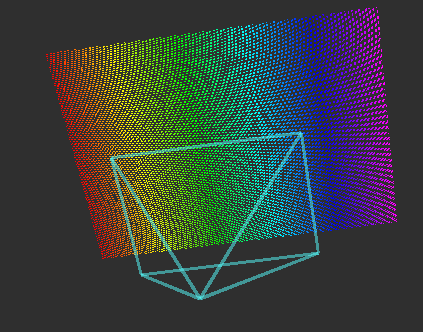

# PlanarPointCloudSimulator


Simulate a pointcloud which is acquired by cameras such as stereo camera and kinect.
Sensor model is pinhole camera model.

## Subscribing Topics
* `~input` (`sensor_msgs/CameraInfo`)

  Camera info to simulate pointcloud.

## Publishing Topics
* `~output` (`sensor_msgs/PointCloud2`)

  Simulated planar pointcloud.

## Parameters
* `~distance` (Double, default: `1.0`)

  Distance to pointcloud from origin along z-axis.

## Sample

```
roslaunch jsk_pcl_ros_utils sample_planar_pointcloud_simulator.launch
```
