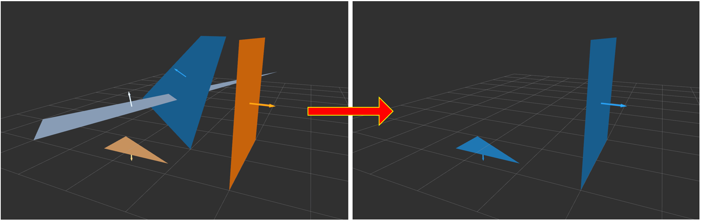

# PlaneReasoner

## What Is This


Pass through horizontal or vertical planes from input planes.


## Subscribing Topic

* `~input` (`sensor_msgs/PointCloud2`)

  Input point cloud.

  Only header of this topic is used for published topics.

* `~input_inliers` (`jsk_recognition_msgs/ClusterPointIndices`)

  Input cluster point indices of planes.

  This topic is not used for filtering, and only filtered plane indices will be published.

* `~input_polygons` (`jsk_recognition_msgs/PolygonArray`)

  Input plane polygons.

* `~input_coefficients` (`jsk_recognition_msgs/ModelCoefficientsArray`)

  Input normal coefficients of planes.


## Publishing Topic

* `~output/vertical/inliers` (`jsk_recognition_msgs/ClusterPointIndices`)

  Filtered cluster point indices of vertical planes.

* `~output/vertical/polygons` (`jsk_recognition_msgs/PolygonArray`)

  Filtered vertical plane polygons.

* `~output/vertical/coefficients` (`jsk_recognition_msgs/ModelCoefficientsArray`)

  Filtered normal coefficients of vertical planes.

* `~output/horizontal/inliers` (`jsk_recognition_msgs/ClusterPointIndices`)

  Filtered cluster point indices of horizontal planes.

* `~output/horizontal/polygons` (`jsk_recognition_msgs/PolygonArray`)

  Filtered horizontal plane polygons.

* `~output/horizontal/coefficients` (`jsk_recognition_msgs/ModelCoefficientsArray`)

  Filtered normal coefficients of horizontal planes.


## Parameter

* `~global_frame_id` (String, default: `odom`)

  Frame ID of filtering coordinates.

  This parameter can be changed by `dynamic_reconfigure`.

* `~horizontal_angular_threshold` (Float, default: `0.1`)

  Angular difference you allow about horizontal planes in radians.

  This parameter can be changed by `dynamic_reconfigure`.

* `~vertical_angular_threshold` (Float, default: `0.1`)

  Angular difference you allow about vertical planes in radians.

  This parameter can be changed by `dynamic_reconfigure`.


## Sample

```bash
roslaunch jsk_pcl_ros_utils sample_plane_reasoner.launch
```
