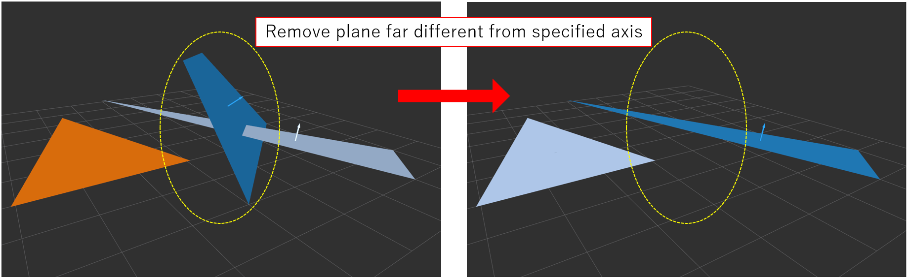

# PlaneRejector

## What Is This


Remove plane if its normal is different from user-defined reference axis.


## Subscribing Topic

* `~input_polygons` (`jsk_recognition_msgs/PolygonArray`)

  Input plane polygons.

* `~input_coefficients` (`jsk_recognition_msgs/ModelCoefficientsArray`)

  Input normal coefficients of planes.

* `~input_inliers` (`jsk_recognition_msgs/ClusterPointIndices`)

  Input cluster point indices.

  This topic is not used for filtering, and only filtered plane indices will be published.

  Subscribed only when `~use_inliers` is set to true.


## Publishing Topic

* `~output_polygons` (`jsk_recognition_msgs/PolygonArray`)

  Filtered plane polygons.

* `~output_coefficients` (`jsk_recognition_msgs/ModelCoefficientsArray`)

  Filtered normal coefficients of planes.

* `~output_inliers` (`jsk_recognition_msgs/ClusterPointIndices`)

  Filtered cluster point indices.

  Published only when `~use_inliers` is set to true.


## Parameter

* `~use_inliers` (Bool, default: `False`)

  Whether to subscribe `~input_inliers`.

* `~allow_flip` (Bool, default: `False`)

  Allow flipping before filtering.

* `~processing_frame_id` (String, __required__)

  Frame ID of `~reference_axis`.

* `~reference_axis` (List of Float, __required__)

  Axis for filtering plane.

  It must be composed of 3 float numbers.

  Planes whose normal coefficients are different from this parameter will be removed.

* `~angle` (Float, default: `0.0`)

  Target angle difference between plane axis and reference axis in radians.

  This parameter can be changed by `dynamic_reconfigure`.

* `~angle_thr` (Float, default: `10.0 / 180.0 * pi`)

  Threshold of allowed angular difference in radians.

  This parameter can be changed by `dynamic_reconfigure`.


## Sample

```bash
roslaunch jsk_pcl_ros_utils sample_plane_rejector.launch
```
