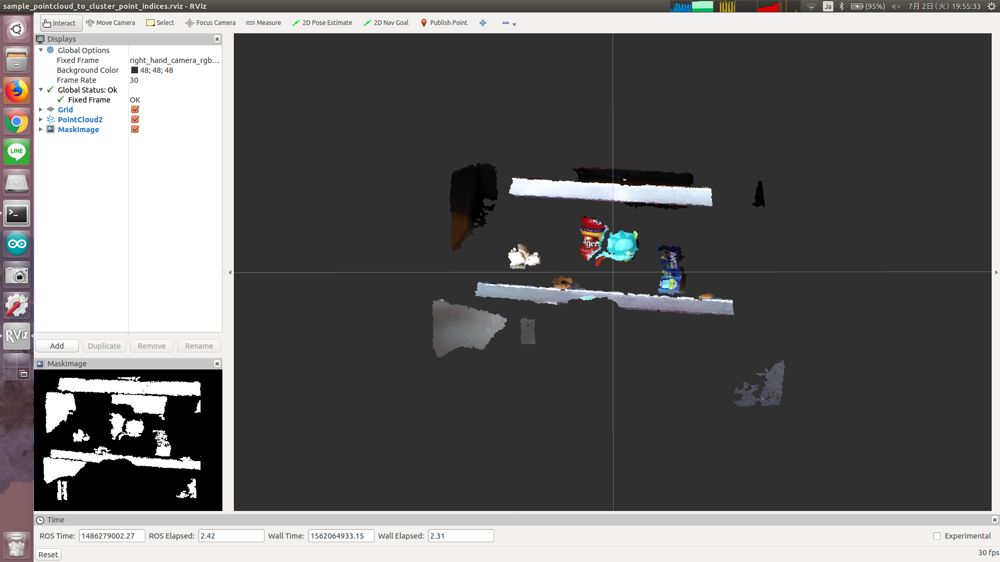

# PointCloudToClusterPointIndices



Just convert pointcloud to `jsk_recognition_msgs/ClusterPointIndices`.
This nodelet is useful to compute bounding box of pointcloud by
[jsk_pcl/ClusterPointIndicesDecomposer](../../jsk_pcl_ros/nodes/cluster_point_indices_decomposer.md).

## Subscribing Topic
* `~input` (`sensor_msgs/PointCloud2`)

  Input pointcloud

## Publishing Topic
* `~output` (`jsk_recognition_msgs/ClusterPointIndices`)

  Output cluster indices.

## Parameter
* `~skip_nan` (Bool, default: `False`)

  Skip NaN points.

## Sample

```bash
roslaunch jsk_pcl_ros_utils sample_pointcloud_to_cluster_point_indices.launch
```
