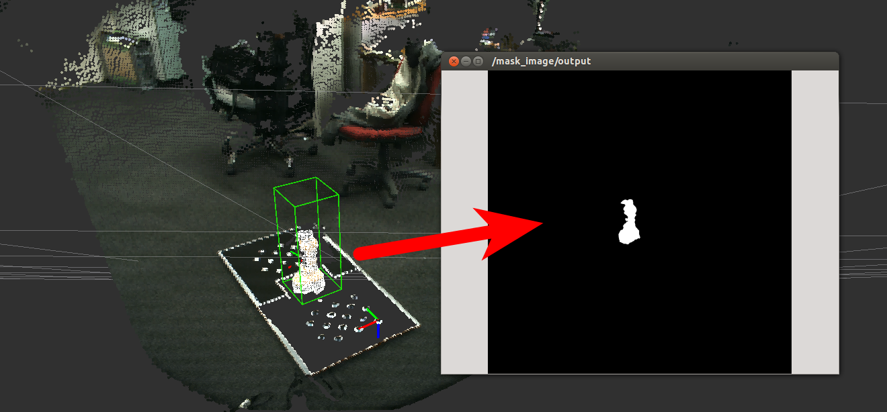

# PointIndicesToMaskImage
## What Is This

jsk\_pcl/PointIndicesToMaskImage generates mask image from `pcl_msgs/PointIndices`
of organized pointcloud and original `sensor_msgs/Image`.

## Subscribing Topic
* `~input` (`pcl_msgs/PointIndices`)

   Indices of the point cloud to mask.

* `~input/image` (`sensor_msgs/Image`)

   In order to know width and height of the original image, jsk\_pcl/PointIndicesToMaskImage requires
   input image. (**Note** If parameter `~static_image_size` is `True`, this topic is not subscribed.)

## Publishing Topic

* `~output `(`sensor_msg/Image`)

   Mask image to get `~input` indices from the origina limage.

## Parameters

* `~approximate_sync` (Bool, default: `false`)

  Approximately synchronize inputs if it's true.

* `~queue_size` (Int, default: `100`)

  How many messages you allow about the subscriber to keep in the queue.
  This should be big when there is much difference about delay between two topics.

* `~static_image_size` (Bool, default: `false`)

  If this parameter is true, the topic `~input/image` is not used and paramter
  `~height` and `~width` is used to generate mask image.

**Optional**

* `~height`, `~width` (Int)

  Size of mask image which will be generated.
