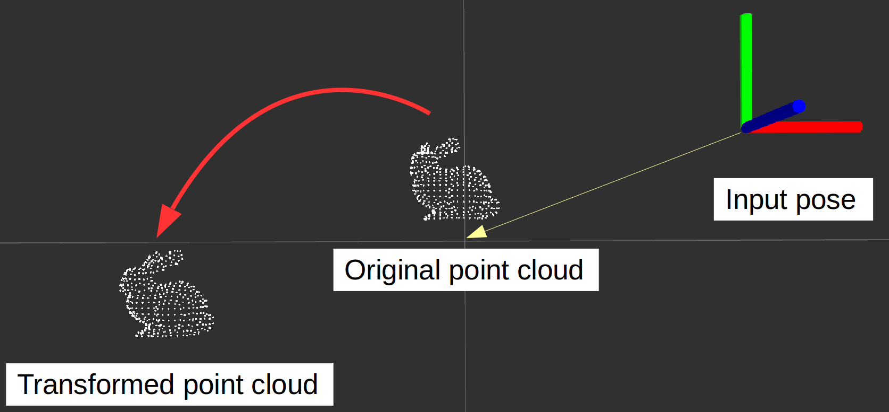

# PointCloudRelativeFromPoseStamped



Transform pointcloud relative from the specified pose stamped.
It is useful for preprocessing of registration to detect initial pose.

## Subscribing Topics
* `~input` (`sensor_msgs/PointCloud2`)

  Original point cloud.

* `~input/pose` (`geometry_msgs/PoseStamped`)

  Pose from which original point cloud will be transformed.


## Publishing Topics
* `~output` (`sensor_msgs/PointCloud2`)

  Transformed point cloud.


## Parameters
* `~approximate_sync` (Bool, default: `False`)

  Whether to allow approximate synchronization of input topics.


## Sample

```bash
roslaunch jsk_pcl_ros_utils sample_pointcloud_relative_from_pose_stamped.launch
```
