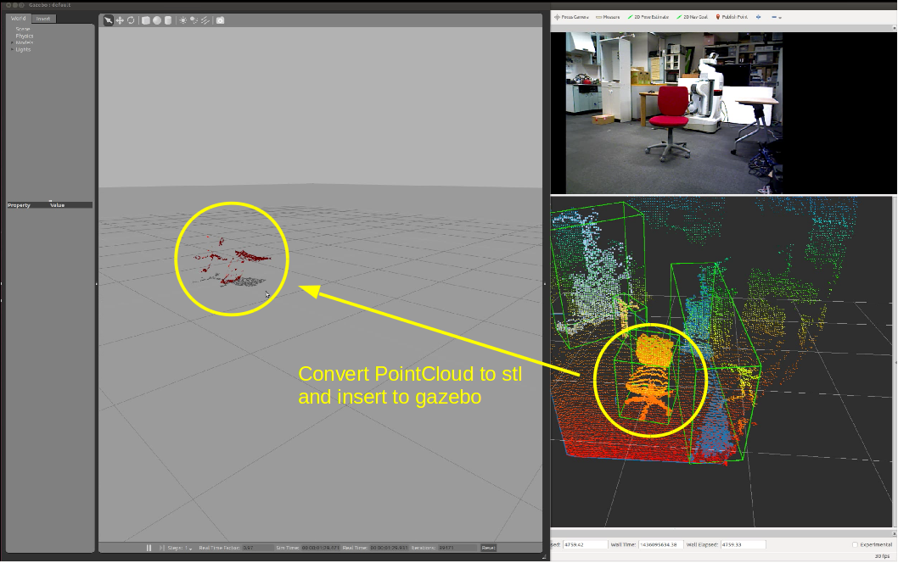

# PointcloudToSTL


## What Is This
This nodelet converts organized pointcloud to stl mesh
using `pcl::OrganizedFastMesh` and generates a stl file.


## Subscribing Topic
* `~input` (`sensor_msgs/PointCloud2`)

  Organized point cloud.


## Publishing Topic
* `~pc_stl_mesh` (`visualization_msgs/Marker`)

  Marker of output mesh.


## Advertising Services
* `~create_stl` (`jsk_recognition_msgs/SetPointCloud2`):

  Service API to create a stl file from pointcloud data.

  Returns output filename.


## Parameters
* `~filename` (String, default: `/tmp/$(ros::Time::now().toNSec())_pointcloud.stl`)

  Path to STL mesh file.

* `~triangle_pixel_size` (Float, default: `1.0`)

  Edge length (in pixels) used for constructing the fixed mesh.

* `~max_edge_length` (Float, default: `4.5`)

  Maximum edge length.

* `~store_shadow_faces` (Bool, default: `True`)

  Store shadowed faces or not.

* `~search_radius` (Float, default: `0.05`)
* `~mu` (Float, default: `3.5`)
* `~maximum_nearest_neighbors` (Int, default: `100`)
* `~maximum_surface_angle` (Float, default: `pi / 4`)
* `~minimum_angle` (Float, default: `pi / 18`)
* `~maximum_angle` (Float, default: `pi * 2 / 3`)
* `~normal_consistency` (Bool, default: `False`)

  These parametes are not used now.


## Sample

```bash
roslaunch jsk_pcl_ros_utils sample_pointcloud_to_stl.launch
```
