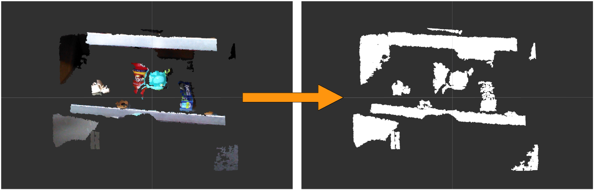

# PointCloudXYZRGBToXYZ



## What is this?

Node to convert fields of `sensor_msgs/PointCloud2` from `XYZRGB` to `XYZ`.


## Subscribing Topic

* `~input` (`sensor_msgs/PointCloud2`)

  Input cloud whose field is `XYZRGB`.


## Publishing Topic

* `~output` (`sensor_msgs/PointCloud2`)

  Output cloud whose field is `XYZ`.


## Sample

```bash
roslaunch jsk_pcl_ros_utils sample_pointcloud_xyzrgb_to_xyz.launch
```
