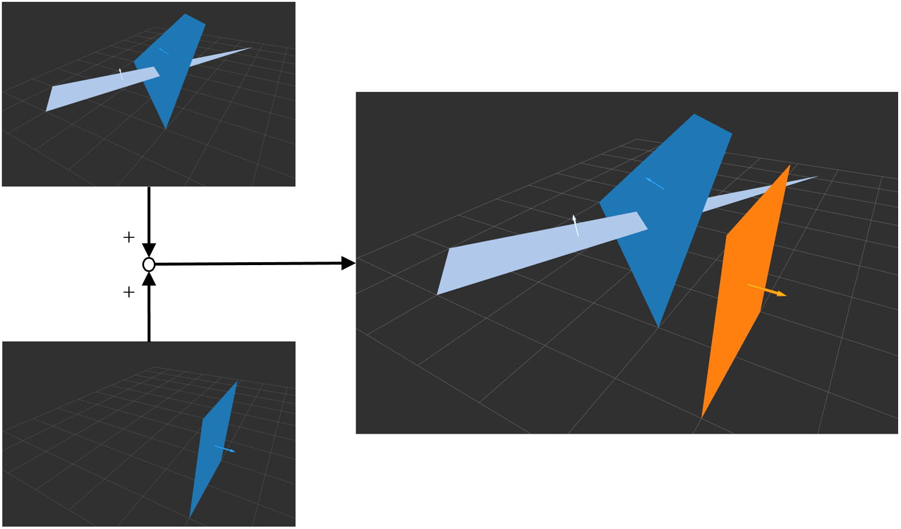

# PolygonAppender

## What Is This


Concatenate two polygon arrays into one.


## Subscribing Topic

* `~input0` (`jsk_recognition_msgs/PolygonArray`)

* `~input1` (`jsk_recognition_msgs/PolygonArray`)

  Input polygons.

* `~input_coefficients0` (`jsk_recognition_msgs/ModelCoefficientsArray`)

* `~input_coefficients1` (`jsk_recognition_msgs/ModelCoefficientsArray`)

  Input normal coefficients of polygons.


## Publishing Topic

* `~output` (`jsk_recognition_msgs/PolygonArray`)

  Concatenated polygons.

* `~output_coefficients` (`jsk_recognition_msgs/ModelCoefficientsArray`)

  Concatenated normal coefficients of polygons.


## Sample

```bash
roslaunch jsk_pcl_ros_utils sample_polygon_appender.launch
```
