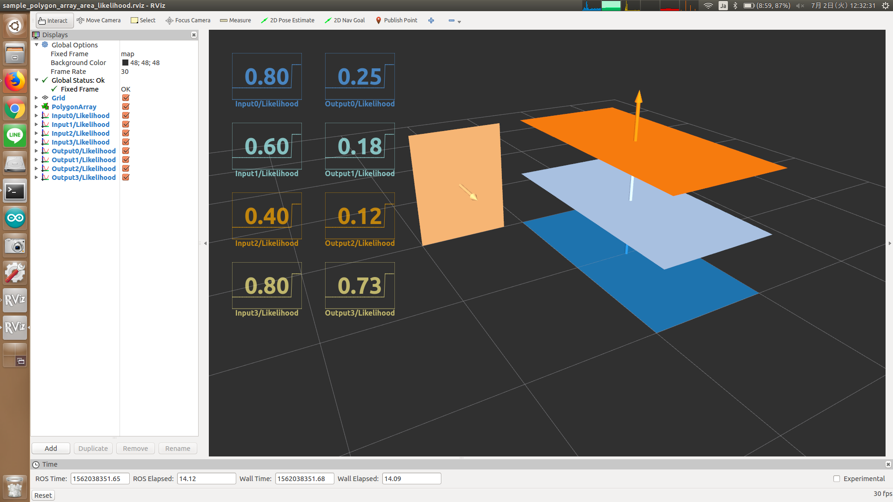

# PolygonArrayAreaLikelihood



Compute likelihood based on area.
The nearer polygon is, the larger likelihood is.

The likelihood is determined by `1/(1+d^2)` where `d` is difference between area and expected area.

## Subscribing Topic
* `~input` (`jsk_recognition_msgs/PolygonArray`)

  Input polygon array.

## Publishing Topic
* `~output` (`jsk_recognition_msgs/PolygonArray`)

  Output polygon array.

## Parameters
* `~area` (Float, default: `1.0`)

  Expected size of area of polygon.

## Sample

```bash
roslaunch jsk_pcl_ros_utils sample_polygon_array_area_likelihood.launch
```
