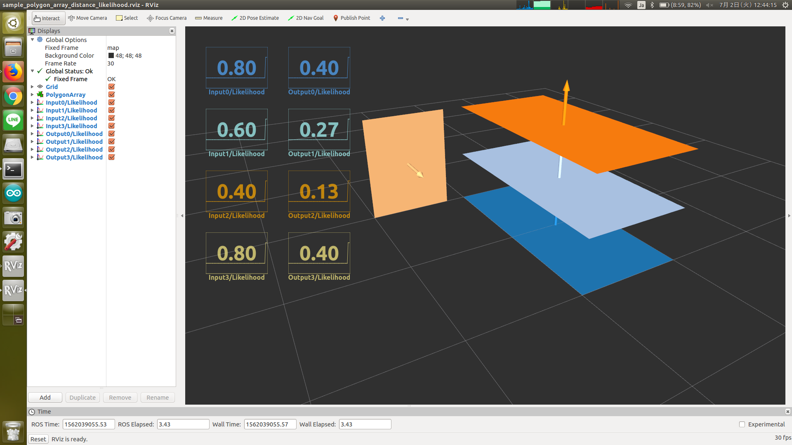

# PolygonArrayDistanceLikelihood



Compute likelihood based on distance.
The nearer polygon is, the larger likelihood is.

The likelihood is determined by `1/(1+d^2)` where `d` is a distance from `~target_frame_id` to the polygon.

## Subscribing Topic
* `~input` (`jsk_recognition_msgs/PolygonArray`)

  Input polygon array.

## Publishing Topic
* `~output` (`jsk_recognition_msgs/PolygonArray`)

  Output polygon array.

## Parameters
* `~target_frame_id` (String, required)

  Frame id to compute polygon's distance from.

* `~tf_queue_size` (Int, default: `10`)

  Queue size of tf message filter

## Sample

```bash
roslaunch jsk_pcl_ros_utils sample_polygon_array_distance_likelihood.launch
```
