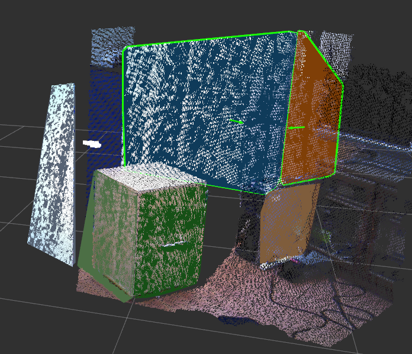

PolygonArrayLikelihoodFilter
============================

Filter ``jsk_recognition_msgs/PolygonArray`` by likelihood.

Subscribing Topics
------------------

* ``~input_polygons`` (``jsk_recognition_msgs/PolygonArray``)

  Input polygon array.

* ``~input_coefficients`` (``jsk_recognition_msgs/ModelCoefficientsArray``)

  Input coefficients array.
  (Enabled if ``use_coefficients`` is ``true``. Expected the same order with input polygons)

Publishing Topics
-----------------

* ``~output_polygons`` (``jsk_recognition_msgs/PolygonArray``)

  Filtered polygon array. (Polygons are sorted by their likelihood.)

* ``~output_coefficients`` (``jsk_recognition_msgs/ModelCoefficientsArray``)

  Filtered coefficients array. (Published only if ``use_coefficients`` is ``true``.)

Parameters
----------

* ``~use_coefficients`` (Bool, default: ``true``)

  If ``true``, polygons and coefficients are subscribed and published synchronously.

* ``~threshold`` (Double, default: ``0.5``)

  Threshold for filtering polygons.
  See also description of ``~negative`` below for more detail.

* ``~negative`` (Bool, default: ``false``)

  If ``false``, published polygons whose likelihood is higher than ``~threshold``, lower otherwise.
