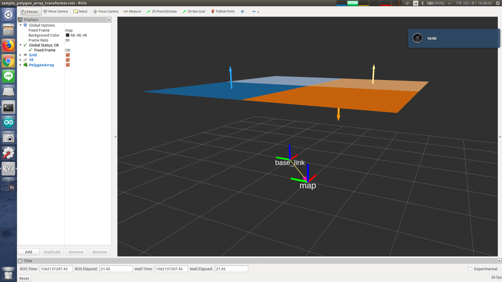

# PolygonArrayTransformer



Change frame_id of `jsk_recognition_msgs/PolygonArray` according to tf.


## Subscribe Topics
* `~input_polygons` (`jsk_recognition_msgs/PolygonArray`)
* `~input_coefficients` (`jsk_recognition_msgs/ModelCoefficientsArray`)

  Input polygon array.

## Publishing Topics
* `~output_polygons` (`jsk_recognition_msgs/PolygonArray`)
* `~output_coefficients` (`jsk_recognition_msgs/ModelCoefficientsArray`)

  Output polygon array.

## Parameter
* `~frame_id` (String, required)

  Frame-id to transform to.

## Sample

```bash
roslaunch jsk_pcl_ros_utils sample_polygon_array_transformer.launch
```
