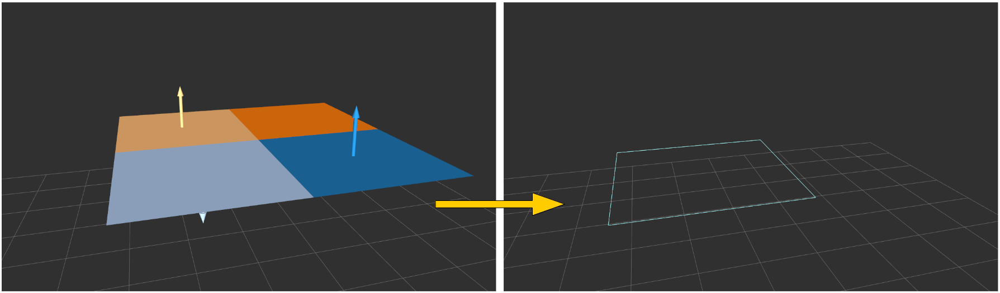

PolygonArrayUnwrapper
=====================

What is this?
-------------

Convert ``jsk_recognition_msgs/PolygonArray`` to ``geometry_msgs/PolygonStamped``,
and ``jsk_recognition_msgs/ModelCoefficientsArray`` to ``pcl_msgs/ModelCoefficients``.

Subscribing Topics
------------------

* ``~input_polygons`` (``jsk_recognition_msgs/PolygonArray``)

  Input polygon array.

* ``~input_coefficients`` (``jsk_recognition_msgs/ModelCoefficientsArray``)

  Input coefficients array. (expected the same order with input polygons)

Publishing Topics
-----------------

* ``~output_polygon`` (``geometry_msgs/PolygonStamped``)

  Target polygon.
  (If ``~use_likelihood`` is true, the plane which has the highest likelihood is selected,
  otherwise the first plane in array is selected.)

* ``~output_coefficients`` (``pcl_msgs/ModelCoefficients``)

  Output coefficients.

Parameters
----------

* ``~use_likelihood`` (Bool, default: ``false``)

  If ``true``, likelihood is used to select plane to be unwrapped.

* ``~plane_index`` (Int, default: ``0``)

  If ``~use_likelihood`` is ``false``, this index is used to select output plane.

Sample
------

.. code-block:: bash

  roslaunch jsk_pcl_ros_utils sample_polygon_array_unwrapper.launch
