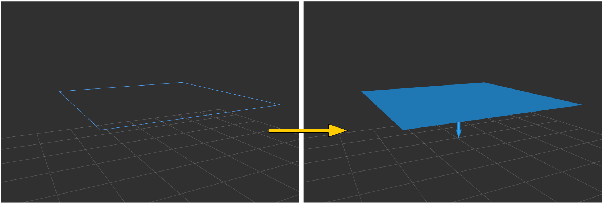

PolygonArrayWrapper
===================

What is this?
-------------

Wrap ``geometry_msgs/PolygonStamped`` and ``pcl_msgs/ModelCoefficients`` into
``jsk_recognition_msgs/PolygonArray`` and ``jsk_recognition_msgs/ModelCoefficientsArray``.

Subscribing Topics
------------------

* ``~input_polygon`` (``geometry_msgs/PolygonStamped``)

  Input polygon.

* ``~input_coefficients`` (``pcl_msgs/ModelCoefficients``)

  Input coefficients.

Publishing Topics
-----------------

* ``~output_polygons`` (``jsk_recognition_msgs/PolygonArray``)

  Output polygon array.

* ``~output_coefficients`` (``jsk_recognition_msgs/ModelCoefficientsArray``)

  Output coefficients array.

Sample
------

.. code-block:: bash

  roslaunch jsk_pcl_ros_utils sample_polygon_array_wrapper.launch
