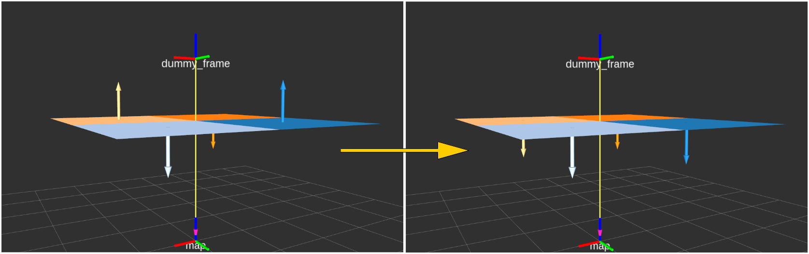

# PolygonFlipper



Flip `jsk_recognition_msgs/PolygonArray` to specified sensor_frame.

## Subscribing Topic
* `~input/polygons` (`jsk_recognition_msgs/PolygonArray`)
* `~input/coefficients` (`jsk_recognition_msgs/ModelCoefficientsArray`)
* `~input/indices` (`jsk_recognition_msgs/ClusterPointIndices`)

  Input polygons.
  If `~use_indices` is disabled, `~input/indices` is not used.


## Publishing Topic
* `~output/polygons` (`jsk_recognition_msgs/PolygonArray`)
* `~output/coefficients` (`jsk_recognition_msgs/ModelCoefficientsArray`)
* `~output/indices` (`jsk_recognition_msgs/ClusterPointIndices`)

  Output flipped polygons which look at the origin of sensor_frame.
  If `~use_indices` is disabled, `~output/indices` is not published.


## Parameter
* `~sensor_frame` (`String`, Required):

   The frame_id of sensor for polygons to look at.

* `~queue_size` (`Int`, default: `100`):

   Queue size of subscribed messages for message synchronization.

* `~use_indices` (`Bool`, default: `true`):

   Use indices if this parameter is enabled.


## Sample

```bash
roslaunch jsk_pcl_ros_utils sample_polygon_flipper.launch
```
