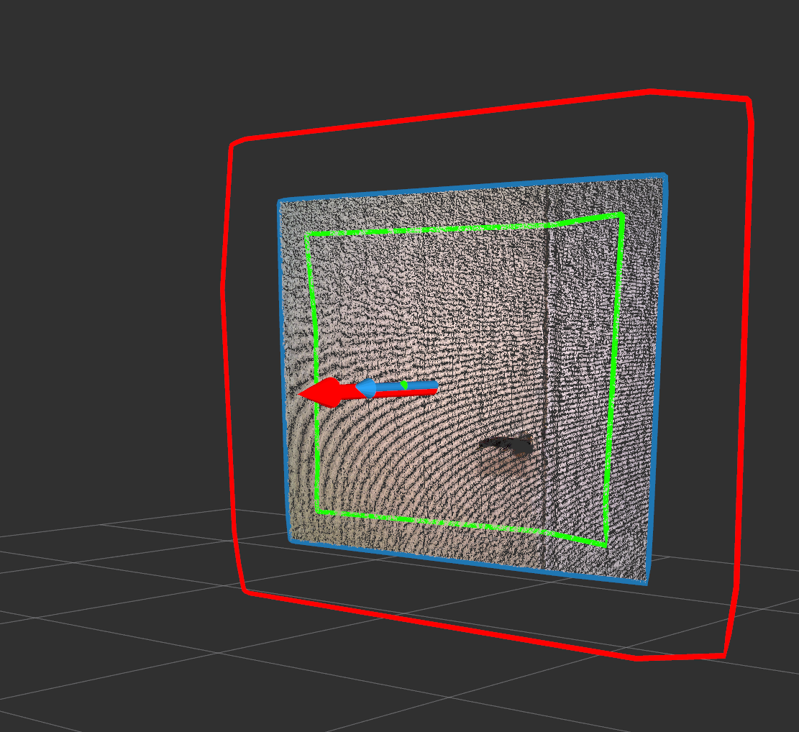

# PolygonMagnifier



Magnify polygons by specified length.

## Subscribing Topic
* `~input` (`jsk_recognition_msgs/PolygonArray`)

  Input polygons

## Publishing Topic
* `~output` (`jsk_recognition_msgs/PolygonArray`)

  Output magnified polygons

## Parameters

* `~use_scale_factor` (Bool, default: `false`)

  If this is set `true`, use scale factor to magnify, otherwise use distance.

* `~magnify_distance` (Double, default: `0.2`)

  Length to scale polygons. Default value `0.2` means the distance of each corresponding edges will be `0.2` m.
  If this value is less than `0`, output polygons are shrinked.

* `~magnify_scale_factor` (Double, default: `0.8`)

  Factor to scale polygons. Default value `0.8` means the volume of magnified polygons are 80% of the original polygons.
  This parameter is valid only when `~use_scale_factor` is set `true`.

## Sample

``` bash
roslaunch jsk_pcl_ros_utils sample_polygon_magnifier.launch
```
